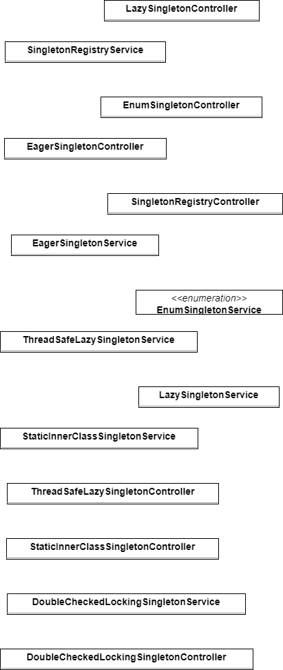
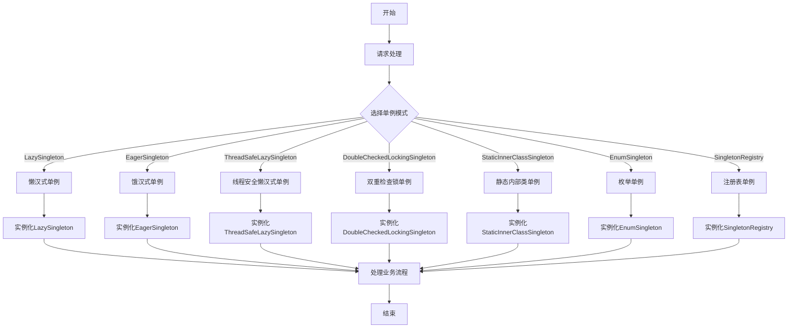

# 0.基础信息

## 0.0代码架构图



## 0.1业务架构图




## 0.2请求测试标准

# 1.代码分析

## 1.2Service设计

```java
package com.xiaoyongcai.io.designmode.Service.CreationalPatterns.SingletonPattern;

import lombok.extern.slf4j.Slf4j;

@Slf4j
public class LazySingletonService {
    /**
     * 懒汉式单例模式：
     * 优点：延迟加载，节省资源
     * 缺点：线程不安全，多线程环境下可能会创建多个实例
     * 解决方案：使用synchronized关键字进行同步，保证线程安全
     * 缺点：每次获取实例都需要进行同步，效率较低
     * 解决方案：双重检查锁定（Double-Checked Locking）
     */
    private static LazySingletonService lazySingletonService;
    private LazySingletonService() {};
    public static synchronized LazySingletonService getInstance() {
        if(lazySingletonService == null) {
            lazySingletonService = new LazySingletonService();
        }
        return lazySingletonService;
    }

    public String processWorkflow(){
        log.info("[单例模式-1]：线程不安全的懒汉式单例模式运行成功，数据请回看api接口反馈");
        return "[单例模式-1]：线程不安全的懒汉式单例模式运行成功，数据请回看api接口反馈";
    }
}

```

```java
package com.xiaoyongcai.io.designmode.Service.CreationalPatterns.SingletonPattern;

import lombok.extern.slf4j.Slf4j;

@Slf4j
public class EagerSingletonService {
    private static final EagerSingletonService eagerSingletonService = new EagerSingletonService();

    private EagerSingletonService() {
    }

    public static EagerSingletonService getInstance() {
        return eagerSingletonService;
    }

    public String processWorkflow(){
        log.info("[单例模式-2]：饿汉式单例模式运行成功，数据请回看api接口反馈");
        return "[单例模式-2]：饿汉式单例模式运行成功，数据请回看api接口反馈";
    }

}

```

```java
package com.xiaoyongcai.io.designmode.Service.CreationalPatterns.SingletonPattern;

import lombok.extern.slf4j.Slf4j;

@Slf4j
public class ThreadSafeLazySingletonService {

    private static ThreadSafeLazySingletonService instance;

    private ThreadSafeLazySingletonService() {}

    public static synchronized ThreadSafeLazySingletonService getInstance() {
        if (instance == null) {
            instance = new ThreadSafeLazySingletonService();
        }
        return instance;
    }

    public String processWorkflow() {
        // 处理工作流业务
        log.info("[单例模式-3]：线程安全的懒汉单例模式运行成功，数据请回看api接口反馈");
        return "[单例模式-3]：线程安全的懒汉单例模式运行成功，数据请回看api接口反馈";
    }
}

```

```java
package com.xiaoyongcai.io.designmode.Service.CreationalPatterns.SingletonPattern;

import lombok.extern.slf4j.Slf4j;

/**
 *双重检查锁：为何要在锁中进行第二次检查呢？
 * 因为第一次检查是为了避免不必要的同步，
 * 而第二次检查是确保在进入同步块之前，instance尚未被初始化完成，
 * 避免多线程同时进入同步块导致instance被重复初始化。
 *
 */
@Slf4j
public class DoubleCheckedLockingSingletonService {
    private volatile static DoubleCheckedLockingSingletonService instance;

    private DoubleCheckedLockingSingletonService() {}

    public static DoubleCheckedLockingSingletonService getInstance() {
        if (instance == null) {
            synchronized (DoubleCheckedLockingSingletonService.class) {
                if (instance == null) {
                    instance = new DoubleCheckedLockingSingletonService();
                }
            }
        }
        return instance;
    }

    public String processWorkflow() {
        // 处理工作流业务
        log.info("[单例模式-4]：双重检查锁单例模式运行成功，数据请回看api接口反馈");
        return "[单例模式-4]：双重检查锁单例模式运行成功，数据请回看api接口反馈";
    }
}

```

```java
package com.xiaoyongcai.io.designmode.Service.CreationalPatterns.SingletonPattern;

import lombok.extern.slf4j.Slf4j;

@Slf4j
public class StaticInnerClassSingletonService {
    /*
    *  静态内部类单例利用了类加载机制保证了线程安全，同时实现了懒加载。
    *  原因是：静态代码块是共有且最先加载，且只加载一次的
    * */
    private StaticInnerClassSingletonService() {}

    private static class SingletonHolder {
        private static final StaticInnerClassSingletonService INSTANCE = new StaticInnerClassSingletonService();
    }

    public static StaticInnerClassSingletonService getInstance() {
        return SingletonHolder.INSTANCE;
    }

    public String processWorkflow() {
        // 处理工作流业务
        log.info("[单例模式-5]：静态内部类单例模式运行成功，数据请回看api接口反馈");
        return "[单例模式-5]：静态内部类单例模式运行成功，数据请回看api接口反馈";
    }
}

```

```java
package com.xiaoyongcai.io.designmode.Service.CreationalPatterns.SingletonPattern;

import lombok.extern.slf4j.Slf4j;

@Slf4j
public enum EnumSingletonService {
    INSTANCE;

    public String processWorkflow() {
        // 处理工作流业务
        log.info("[单例模式-6]：枚举单例模式运行成功，数据请回看api接口反馈");
        return "[单例模式-6]：枚举单例模式运行成功，数据请回看api接口反馈";
    }
}

```

```java
package com.xiaoyongcai.io.designmode.Service.CreationalPatterns.SingletonPattern;

import lombok.extern.slf4j.Slf4j;
import org.springframework.stereotype.Service;

import java.util.HashMap;
import java.util.Map;
@Slf4j
@Service
public class SingletonRegistryService {


    private static final Map<String, Object> instances = new HashMap<>();

    private SingletonRegistryService() {}

    public static synchronized Object getInstance(String className) {

        if (!instances.containsKey(className)) {
            try {
                instances.put(className,new SingletonRegistryService());
            } catch (Exception e) {
                e.printStackTrace();
            }
        }
        return instances.get(className);
    }

    public String processWorkflow() {
        // 处理工作流业务
        log.info( "[单例模式-7]：注册表单例模式运行成功，数据请回看api接口反馈");
        return "[单例模式-7]：注册表单例模式运行成功，数据请回看api接口反馈";
    }
}


```


## 1.3Controller设计

```java
package com.xiaoyongcai.io.designmode.Controller.CreationalPatterns.SingletonPattern;

import com.xiaoyongcai.io.designmode.Service.CreationalPatterns.SingletonPattern.LazySingletonService;
import org.springframework.http.ResponseEntity;
import org.springframework.web.bind.annotation.GetMapping;
import org.springframework.web.bind.annotation.RequestMapping;
import org.springframework.web.bind.annotation.RestController;

@RestController
@RequestMapping("/lazySingleton")
public class LazySingletonController {

    @GetMapping("/process")
    public ResponseEntity<String> processWorkflow() {
        LazySingletonService lazySingletonService = LazySingletonService.getInstance();
        String result = lazySingletonService.processWorkflow();
        return ResponseEntity.ok(result);
    }
}

```

```java
package com.xiaoyongcai.io.designmode.Controller.CreationalPatterns.SingletonPattern;

import com.xiaoyongcai.io.designmode.Service.CreationalPatterns.SingletonPattern.EagerSingletonService;
import org.springframework.http.ResponseEntity;
import org.springframework.web.bind.annotation.GetMapping;
import org.springframework.web.bind.annotation.RequestMapping;
import org.springframework.web.bind.annotation.RestController;

@RestController
@RequestMapping("/eagerSingleton")
public class EagerSingletonController {

    @GetMapping("/process")
    public ResponseEntity<String> processWorkflow() {
        EagerSingletonService eagerSingletonService = EagerSingletonService.getInstance();
        String result = eagerSingletonService.processWorkflow();
        return ResponseEntity.ok(result);
    }
}

```

```java
package com.xiaoyongcai.io.designmode.Controller.CreationalPatterns.SingletonPattern;

import com.xiaoyongcai.io.designmode.Service.CreationalPatterns.SingletonPattern.ThreadSafeLazySingletonService;
import org.springframework.http.ResponseEntity;
import org.springframework.web.bind.annotation.GetMapping;
import org.springframework.web.bind.annotation.RequestMapping;
import org.springframework.web.bind.annotation.RestController;

@RestController
@RequestMapping("/threadSafeLazySingleton")
public class ThreadSafeLazySingletonController {

    @GetMapping("/process")
    public ResponseEntity<String> processWorkflow() {
        ThreadSafeLazySingletonService threadSafeLazySingletonService = ThreadSafeLazySingletonService.getInstance();
        String result = threadSafeLazySingletonService.processWorkflow();
        return ResponseEntity.ok(result);
    }
}


```

```java
package com.xiaoyongcai.io.designmode.Controller.CreationalPatterns.SingletonPattern;

import com.xiaoyongcai.io.designmode.Service.CreationalPatterns.SingletonPattern.DoubleCheckedLockingSingletonService;
import org.springframework.http.ResponseEntity;
import org.springframework.web.bind.annotation.GetMapping;
import org.springframework.web.bind.annotation.RequestMapping;
import org.springframework.web.bind.annotation.RestController;

@RestController
@RequestMapping("/doubleCheckedLockingSingleton")
public class DoubleCheckedLockingSingletonController {

    @GetMapping("/process")
    public ResponseEntity<String> processWorkflow() {
        DoubleCheckedLockingSingletonService doubleCheckedLockingSingletonService = DoubleCheckedLockingSingletonService.getInstance();
        String result = doubleCheckedLockingSingletonService.processWorkflow();
        return ResponseEntity.ok(result);
    }
}

```

```java
package com.xiaoyongcai.io.designmode.Controller.CreationalPatterns.SingletonPattern;

import com.xiaoyongcai.io.designmode.Service.CreationalPatterns.SingletonPattern.StaticInnerClassSingletonService;
import org.springframework.http.ResponseEntity;
import org.springframework.web.bind.annotation.GetMapping;
import org.springframework.web.bind.annotation.RequestMapping;
import org.springframework.web.bind.annotation.RestController;

@RestController
@RequestMapping("/staticInnerClassSingleton")
public class StaticInnerClassSingletonController {

    @GetMapping("/process")
    public ResponseEntity<String> processWorkflow() {
        StaticInnerClassSingletonService staticInnerClassSingletonService = StaticInnerClassSingletonService.getInstance();
        String result = staticInnerClassSingletonService.processWorkflow();
        return ResponseEntity.ok(result);
    }
}

```

```java
package com.xiaoyongcai.io.designmode.Controller.CreationalPatterns.SingletonPattern;

import com.xiaoyongcai.io.designmode.Service.CreationalPatterns.SingletonPattern.EnumSingletonService;
import org.springframework.http.ResponseEntity;
import org.springframework.web.bind.annotation.GetMapping;
import org.springframework.web.bind.annotation.RequestMapping;
import org.springframework.web.bind.annotation.RestController;

@RestController
@RequestMapping("/enumSingleton")
public class EnumSingletonController {

    @GetMapping("/process")
    public ResponseEntity<String> processWorkflow() {
        String result = EnumSingletonService.INSTANCE.processWorkflow();
        return ResponseEntity.ok(result);
    }
}

```

```java
package com.xiaoyongcai.io.designmode.Controller.CreationalPatterns.SingletonPattern;

import com.xiaoyongcai.io.designmode.Service.CreationalPatterns.SingletonPattern.SingletonRegistryService;
import org.springframework.http.ResponseEntity;
import org.springframework.web.bind.annotation.GetMapping;
import org.springframework.web.bind.annotation.PathVariable;
import org.springframework.web.bind.annotation.RequestMapping;
import org.springframework.web.bind.annotation.RestController;

@RestController
@RequestMapping("/singletonRegistry")
public class SingletonRegistryController {

    @GetMapping("/process/{className}")
    public ResponseEntity<String> processWorkflow(@PathVariable String className) {
        Object instance = SingletonRegistryService.getInstance(className);
        if (instance instanceof SingletonRegistryService) {
            String result = ((SingletonRegistryService) instance).processWorkflow();
            return ResponseEntity.ok(result);
        }
        return ResponseEntity.badRequest().body("Invalid class name");
    }
}

```

