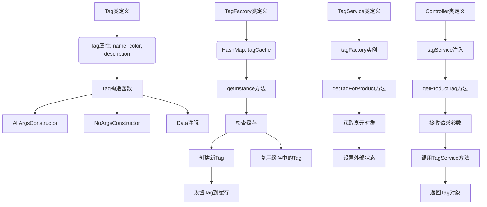

# 0.基础信息

## 0.0代码架构图

## 0.1业务架构图




## 0.2请求测试标准

```json
localhost:8080/FlyweightPattern/tags?name=热销商品&color=红色&description=这里是热销商品的描述,注意：这部分不是共享的哦！
get请求
```


# 1.代码分析

## 1.1Pojo设计

```java
package com.xiaoyongcai.io.designmode.pojo.StructuralPatterns.FlyweightPattern;

import lombok.AllArgsConstructor;
import lombok.Data;
import lombok.NoArgsConstructor;

//Tag类,作为享元对象
@AllArgsConstructor
@NoArgsConstructor
@Data
public class Tag {
    private String name;//内部状态：标签名称，多个商品共享
    private String color;//内部状态：标签颜色，可以共享
    private String description;//外部状态：标签描述，可能因为商品不同而不同

    public Tag(String name,String color){
        this.name=name;
        this.color=color;
    }
}

```

```java
package com.xiaoyongcai.io.designmode.pojo.StructuralPatterns.FlyweightPattern;

import lombok.extern.slf4j.Slf4j;

import java.util.HashMap;
import java.util.Map;
@Slf4j
public class TagFactory {
    private Map<String,Tag> tagCache = new HashMap<>();

    public Tag getInstance(String name,String color){
        //生成唯一的key，由name和color组成
        //在真实业务中，这一块生成的是redis中的key
        String key = name+"-"+color;
        if(!tagCache.containsKey(key)){
            log.info("key:"+key+"尚未出现在缓存中,此时往缓存中添加该key对应的Tag,注意：在工厂中并没有设置其description这个外部属性");
            tagCache.put(key,new Tag(name,color));
        }else if(tagCache.containsKey(key)){
            log.info("key:"+key+"享元模式发挥作用咯！因为你两次请求的tag的内部属性都是一样的！享元模式会复用缓存中已经存在的color和name!只有你的description是不同的");
        }
        return tagCache.get(key);
    }
}

```


## 1.2Service设计

```java
package com.xiaoyongcai.io.designmode.Service.StructuralPatterns.FlyweightPattern;

import com.xiaoyongcai.io.designmode.pojo.StructuralPatterns.FlyweightPattern.Tag;
import com.xiaoyongcai.io.designmode.pojo.StructuralPatterns.FlyweightPattern.TagFactory;
import lombok.extern.slf4j.Slf4j;
import org.springframework.stereotype.Service;

@Service
@Slf4j
public class TagService {
    private TagFactory tagFactory = new TagFactory();

    public Tag getTagForProduct(String name,String color,String description){
        //获取享元对象
        Tag tag = tagFactory.getInstance(name,color);
        //设置外部状态
        tag.setDescription(description);

        return tag;
    }

}

```


## 1.3Controller设计

```java
package com.xiaoyongcai.io.designmode.Controller.StructuralPatterns.FlyweightPattern;

import com.xiaoyongcai.io.designmode.Service.StructuralPatterns.FlyweightPattern.TagService;
import com.xiaoyongcai.io.designmode.pojo.StructuralPatterns.FlyweightPattern.Tag;
import org.springframework.beans.factory.annotation.Autowired;
import org.springframework.web.bind.annotation.GetMapping;
import org.springframework.web.bind.annotation.RequestMapping;
import org.springframework.web.bind.annotation.RequestParam;
import org.springframework.web.bind.annotation.RestController;

@RestController
@RequestMapping("/FlyweightPattern")
public class FlyweightPatternController {
    @Autowired
    private TagService tagService;

    @GetMapping("/tags")
        public Tag getProductTag(@RequestParam String name, @RequestParam String color, @RequestParam String description) {
        return tagService.getTagForProduct(name, color, description);
    }
}

```

