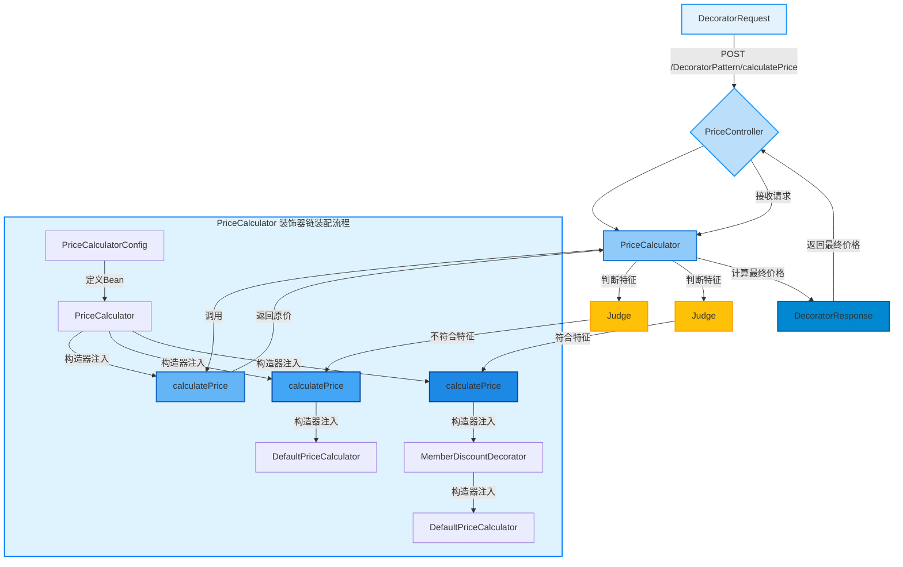

# 0.基础信息

## 0.0代码架构图

## 0.1业务架构图




## 0.2请求测试标准

POST

```java
localhost:8080/DecoratorPattern/calculatePrice
```

```java
{
    "originalPrice":3000,
    "isMember":true,
    "hasCoupon":false
}
```

# 1.代码分析

## 1.1Pojo设计

```java
package com.xiaoyongcai.io.designmode.pojo.StructuralPatterns.DecoratorPattern;

import lombok.AllArgsConstructor;
import lombok.Data;
import lombok.NoArgsConstructor;

@Data
@AllArgsConstructor
@NoArgsConstructor
public class DecoratorRequest {
    private Integer originalPrice;
    private boolean isMember;
    private boolean hasCoupon;
}

```

```java
package com.xiaoyongcai.io.designmode.pojo.StructuralPatterns.DecoratorPattern;

import lombok.AllArgsConstructor;
import lombok.Data;
import lombok.NoArgsConstructor;

@Data
@AllArgsConstructor
@NoArgsConstructor
public class DecoratorResponse {
    private double finalPrice;
}

```


## 1.2Service设计

```java
package com.xiaoyongcai.io.designmode.Service.StructuralPatterns.DecoratorPattern;

import org.springframework.stereotype.Service;
public interface PriceCalculator {
    double calculatePrice(double originalPrice);
}

```

```java
package com.xiaoyongcai.io.designmode.Service.StructuralPatterns.DecoratorPattern;

import org.springframework.beans.factory.annotation.Qualifier;
import org.springframework.stereotype.Service;

public abstract class PriceCalculatorDecorator implements PriceCalculator {

    protected PriceCalculator priceCalculator;  // 被装饰的 PriceCalculator

    // 构造器注入 PriceCalculator
    public PriceCalculatorDecorator(PriceCalculator priceCalculator) {
        this.priceCalculator = priceCalculator;
    }
}
```

```java
package com.xiaoyongcai.io.designmode.Service.StructuralPatterns.DecoratorPattern.Impl;

import com.xiaoyongcai.io.designmode.Service.StructuralPatterns.DecoratorPattern.PriceCalculator;
import lombok.extern.slf4j.Slf4j;
import org.springframework.stereotype.Component;

@Slf4j
@Component  // 将 DefaultPriceCalculator 注册为 Spring Bean
public class DefaultPriceCalculator implements PriceCalculator {

    @Override
    public double calculatePrice(double originalPrice) {
        log.info("[装饰器模式]defaultPriceCalculator被调用了一次");
        return originalPrice;  // 默认返回原价
    }
}
```

```java
    package com.xiaoyongcai.io.designmode.Service.StructuralPatterns.DecoratorPattern.Impl;

    import com.xiaoyongcai.io.designmode.Service.StructuralPatterns.DecoratorPattern.PriceCalculator;
    import com.xiaoyongcai.io.designmode.Service.StructuralPatterns.DecoratorPattern.PriceCalculatorDecorator;
    import lombok.extern.slf4j.Slf4j;
    import org.springframework.stereotype.Component;

    @Slf4j
    @Component  // 使用 @Component 注解以便 Spring 管理这个装饰器
    public class MemberDiscountDecorator extends PriceCalculatorDecorator {

        private static final double MEMBER_DISCOUNT = 0.9; // 会员折扣 10%

        // 构造器注入 PriceCalculator
        public MemberDiscountDecorator(PriceCalculator priceCalculator) {
            super(priceCalculator);  // 传递给父类构造器
        }

        @Override
        public double calculatePrice(double originalPrice) {
            double price = priceCalculator.calculatePrice(originalPrice);
            log.info("[装饰器模式]经过会员判断：目前需要花费"+price*MEMBER_DISCOUNT);// 调用下一个装饰器或默认计算器
            return price * MEMBER_DISCOUNT; // 应用会员折扣
        }
    }


```

```java
package com.xiaoyongcai.io.designmode.Service.StructuralPatterns.DecoratorPattern.Impl;

import com.xiaoyongcai.io.designmode.Service.StructuralPatterns.DecoratorPattern.PriceCalculator;
import com.xiaoyongcai.io.designmode.Service.StructuralPatterns.DecoratorPattern.PriceCalculatorDecorator;
import lombok.extern.slf4j.Slf4j;
import org.springframework.stereotype.Component;

@Slf4j
@Component  // 使用 @Component 注解以便 Spring 管理这个装饰器
public class CouponDiscountDecorator extends PriceCalculatorDecorator {

    private static final double COUPON_DISCOUNT = 0.8; // 优惠券折扣 20%

    // 构造器注入 PriceCalculator
    public CouponDiscountDecorator(PriceCalculator priceCalculator) {
        super(priceCalculator);  // 传递给父类构造器
    }

    @Override
    public double calculatePrice(double originalPrice) {

        double price = priceCalculator.calculatePrice(originalPrice);  // 调用下一个装饰器或默认计算器
        log.info("[装饰器模式]经过优惠卷判断：目前需要花费"+price*COUPON_DISCOUNT);
        return price * COUPON_DISCOUNT; // 应用优惠券折扣
    }
}
```


## 1.3Controller设计

```java
    package com.xiaoyongcai.io.designmode.Controller.StructuralPatterns.DecoratorPattern;

    import com.xiaoyongcai.io.designmode.Service.StructuralPatterns.DecoratorPattern.PriceCalculator;
    import com.xiaoyongcai.io.designmode.pojo.StructuralPatterns.DecoratorPattern.DecoratorRequest;
    import com.xiaoyongcai.io.designmode.pojo.StructuralPatterns.DecoratorPattern.DecoratorResponse;
    import org.springframework.beans.factory.annotation.Autowired;
    import org.springframework.web.bind.annotation.PostMapping;
    import org.springframework.web.bind.annotation.RequestBody;
    import org.springframework.web.bind.annotation.RequestMapping;
    import org.springframework.web.bind.annotation.RestController;

    @RestController
    @RequestMapping("/DecoratorPattern")
    public class PriceController {

        private final PriceCalculator priceCalculator;

        // 构造器注入 PriceCalculator 装饰器链
        @Autowired
        public PriceController(PriceCalculator priceCalculator) {
            this.priceCalculator = priceCalculator;
        }

        @PostMapping("/calculatePrice")
        public DecoratorResponse calculatePrice(@RequestBody DecoratorRequest request) {
            // 使用传入的装饰器链计算最终价格
            double finalPrice = priceCalculator.calculatePrice(request.getOriginalPrice());
            /*
            * 总结来说，装饰器链的调用顺序是由链的构建方式决定的，而不是由Bean的注入顺序决定的。在您提供的配置中，CouponDiscountDecorator是链的入口点，因此它的calculatePrice方法首先被调用。
            * */
            return new DecoratorResponse(finalPrice);
        }
    }
```


## 1.4Config设计

```java
package com.xiaoyongcai.io.designmode.Service.StructuralPatterns.DecoratorPattern;

import com.xiaoyongcai.io.designmode.Service.StructuralPatterns.DecoratorPattern.Impl.CouponDiscountDecorator;
import com.xiaoyongcai.io.designmode.Service.StructuralPatterns.DecoratorPattern.Impl.MemberDiscountDecorator;
import org.springframework.context.annotation.Bean;
import org.springframework.context.annotation.Configuration;
import org.springframework.context.annotation.Lazy;

@Configuration
public class PriceCalculatorConfig {

    @Bean
    //这里的PriceCalculator和MemberDiscountDecorator CouponDiscountDecorator  DefaultPriceCalculator 三者存在循环依赖
    //因此先把defaultPriceCalculator注入了
    //为什么先注入defaultPriceCalculator？这是因为defaultPriceCalculator里面没有对PriceCalculator的依赖
    public PriceCalculator priceCalculator( DefaultPriceCalculator defaultPriceCalculator,
                                           @Lazy MemberDiscountDecorator memberDiscountDecorator,
                                           @Lazy CouponDiscountDecorator couponDiscountDecorator) {
        /*Spring容器在创建Bean时，默认情况下是按照声明顺序或者依赖关系顺序创建和注入Bean的。
        当Spring容器尝试创建 priceCalculator Bean时，它需要 memberDiscountDecorator 和 couponDiscountDecorator。
        但是，为了创建这两个装饰器Bean，Spring容器又需要 priceCalculator，这样就形成了一个闭环，Spring容器无法解决这个问题，因为它无法确定哪个Bean应该先被创建。*/


        /*
        * 通过使用@Lazy注解，您可以告诉Spring容器在真正需要时才创建依赖的Bean。
        * 这样，Spring容器可以先创建 priceCalculator Bean，而不必立即创建 memberDiscountDecorator 和 couponDiscountDecorator。
        * 当 memberDiscountDecorator 和 couponDiscountDecorator 被实际调用时，Spring容器才会创建它们，并且这时 priceCalculator Bean 已经可用。
        * */


        // 确保装饰器链的顺序：先应用会员折扣，再应用优惠券折扣
        return new CouponDiscountDecorator(new MemberDiscountDecorator(defaultPriceCalculator));
    }
}


```

