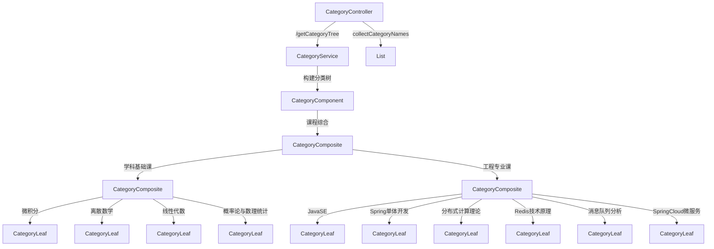

# 0.基础信息

## 0.0代码架构图

## 0.1业务架构图




## 0.2请求测试标准

```java
GET localhost:8080/CompositePattern/getCategoryTree
```

```java
["课程综合", "学科基础课", "微积分", "离散数学", "线性代数", "概率论与数理统计", "工程专业课", "JavaSE", "Spring单体开发", "分布式计算理论", "Redis技术原理", "消息队列分析-Kafka,RabbitMQ,RocketMQ", "SpringCloud微服务开发"]
```


# 1.代码分析

## 1.1Pojo设计

```java
package com.xiaoyongcai.io.designmode.pojo.StructuralPatterns.CompositePattern;

import java.util.List;

public interface CategoryComponent {
    String getName();
    void add(CategoryComponent categoryComponent);//组合模式的add方法
    void remove(CategoryComponent categoryComponent);//组合模式的删除方法
    List<CategoryComponent> getChildren();
}

```

```java
package com.xiaoyongcai.io.designmode.pojo.StructuralPatterns.CompositePattern;

import lombok.*;

import java.util.ArrayList;
import java.util.List;
@Data
@AllArgsConstructor
@NoArgsConstructor
public class CategoryComposite implements CategoryComponent{
    private String name;
    private List<CategoryComponent> children = new ArrayList<CategoryComponent>();
    public CategoryComposite(String name) {
        this.name = name;
    }
    @Override
    public String getName() {
        return name;
    }

    @Override
    public void add(CategoryComponent categoryComponent) {
        children.add(categoryComponent);
    }

    @Override
    public void remove(CategoryComponent categoryComponent) {
        children.remove(categoryComponent);
    }

    @Override
    public List<CategoryComponent> getChildren() {
        return children;
    }
}

```

```java
package com.xiaoyongcai.io.designmode.pojo.StructuralPatterns.CompositePattern;

import lombok.AllArgsConstructor;
import lombok.Data;
import lombok.NoArgsConstructor;

import java.util.ArrayList;
import java.util.List;
@Data
@AllArgsConstructor
@NoArgsConstructor
public class CategoryLeaf implements CategoryComponent{
    private String name;
    @Override
    public String getName() {
        return name;
    }

    @Override
    public void add(CategoryComponent categoryComponent) {
        throw new UnsupportedOperationException("叶子结点不允许朝其中添加元素");
    }

    @Override
    public void remove(CategoryComponent categoryComponent) {
        throw new UnsupportedOperationException("叶子结点不允许删去其子元素，因为其没有子元素");
    }

    @Override
    public List<CategoryComponent> getChildren() {
        return new ArrayList<>();//叶子结点不存在子节点集合
    }
}

```


## 1.2Service设计

```java
package com.xiaoyongcai.io.designmode.Service.StructuralPatterns.CompositePattern;

import com.xiaoyongcai.io.designmode.pojo.StructuralPatterns.CompositePattern.CategoryComponent;
import com.xiaoyongcai.io.designmode.pojo.StructuralPatterns.CompositePattern.CategoryComposite;
import com.xiaoyongcai.io.designmode.pojo.StructuralPatterns.CompositePattern.CategoryLeaf;
import org.springframework.stereotype.Service;

@Service
public class CategoryService {
    public CategoryComponent getCategoryTree(){
        CategoryComposite root = new CategoryComposite("课程综合");

        CategoryComposite baseClass = new CategoryComposite("学科基础课");

        baseClass.add(new CategoryLeaf("微积分"));
        baseClass.add(new CategoryLeaf("离散数学"));
        baseClass.add(new CategoryLeaf("线性代数"));
        baseClass.add(new CategoryLeaf("概率论与数理统计"));

        CategoryComposite ProjectClass = new CategoryComposite("工程专业课");

        ProjectClass.add(new CategoryLeaf("JavaSE"));
        ProjectClass.add(new CategoryLeaf("Spring单体开发"));
        ProjectClass.add(new CategoryLeaf("分布式计算理论"));
        ProjectClass.add(new CategoryLeaf("Redis技术原理"));
        ProjectClass.add(new CategoryLeaf("消息队列分析-Kafka,RabbitMQ,RocketMQ"));
        ProjectClass.add(new CategoryLeaf("SpringCloud微服务开发"));

        root.add(baseClass);
        root.add(ProjectClass);
        return root;
    }
}

```


## 1.3Controller设计

```java
package com.xiaoyongcai.io.designmode.Controller.StructuralPatterns.CompositePattern;

import com.xiaoyongcai.io.designmode.Service.StructuralPatterns.CompositePattern.CategoryService;
import com.xiaoyongcai.io.designmode.pojo.StructuralPatterns.CompositePattern.CategoryComponent;
import lombok.extern.slf4j.Slf4j;
import org.springframework.beans.factory.annotation.Autowired;
import org.springframework.http.ResponseEntity;
import org.springframework.web.bind.annotation.GetMapping;
import org.springframework.web.bind.annotation.RequestMapping;
import org.springframework.web.bind.annotation.RestController;

import java.util.ArrayList;
import java.util.List;
@Slf4j
@RestController
@RequestMapping("/CompositePattern")
public class CategoryController {

    @Autowired
    private CategoryService categoryService;

    @GetMapping("/getCategoryTree")
    public ResponseEntity<List<String>> getCategoryTree() {
        CategoryComponent root = categoryService.getCategoryTree();
        List<String> categoryNames = new ArrayList<>();

        collectCategoryNames(root, categoryNames);
        return ResponseEntity.ok(categoryNames);
    }

    private void collectCategoryNames(CategoryComponent component, List<String> categoryNames) {
        categoryNames.add(component.getName());
        log.info("子项存在 " + component.getName());
        for (CategoryComponent child : component.getChildren()) {
            log.info(component.getName() + " 的子节点:" + child.getName());
            collectCategoryNames(child, categoryNames);
        }
    }

}

```

