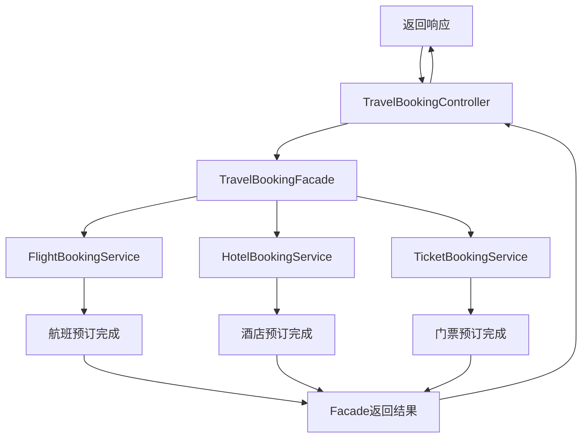

# 0.基础信息

## 0.0代码架构图


## 0.1业务架构图




## 0.2请求测试标准

```java
Post localhost:8080/FacadePattern/book
```

```json
{
  "flightDetails": "从北京到巴黎的航班，日期：2024年12月25日",
  "hotelDetails": "巴黎的酒店，房间类型：双人间，日期：2024年12月25日至2024年12月30日",
  "ticketDetails": "埃菲尔铁塔门票，日期：2024年12月26日"
}

```


# 1.代码分析

## 1.1Pojo设计

```java
package com.xiaoyongcai.io.designmode.pojo.StructuralPatterns.FacadePattern;

import lombok.AllArgsConstructor;
import lombok.Data;
import lombok.NoArgsConstructor;

@Data
@AllArgsConstructor
@NoArgsConstructor
public class TravelRequest {
    //航班细节
    private String flightDetails;
    //酒店细节
    private String hotelDetails;
    //订票细节
    private String ticketDetails;
}

```

## 1.2Service设计

```java
package com.xiaoyongcai.io.designmode.Service.StructuralPatterns.FacadePattern;

import lombok.extern.slf4j.Slf4j;
import org.springframework.stereotype.Service;

@Service
@Slf4j
public class FlightBookingService {
    public String bookFlight(String flightDetails) {
        log.info(flightDetails);
        return "Flight booked: " + flightDetails;
    }
}
```

```java
package com.xiaoyongcai.io.designmode.Service.StructuralPatterns.FacadePattern;

import lombok.extern.slf4j.Slf4j;
import org.springframework.stereotype.Service;

@Service
@Slf4j
public class HotelBookingService {
    public String bookHotel(String hotelDetails) {
        log.info(hotelDetails);
        return "Hotel booked: " + hotelDetails;
    }
}
```

```java
package com.xiaoyongcai.io.designmode.Service.StructuralPatterns.FacadePattern;

import lombok.extern.slf4j.Slf4j;
import org.springframework.stereotype.Service;

@Service
@Slf4j
public class TicketBookingService {
    public String bookTicket(String ticketDetails) {
        log.info(ticketDetails);
        return "Ticket booked: " + ticketDetails;
    }
}
	
```

```java
package com.xiaoyongcai.io.designmode.Service.StructuralPatterns.FacadePattern;

import lombok.extern.slf4j.Slf4j;
import org.springframework.beans.factory.annotation.Autowired;
import org.springframework.stereotype.Service;

@Service
@Slf4j
public class TravelBookingFacade {

    @Autowired
    private FlightBookingService flightBookingService;

    @Autowired
    private HotelBookingService hotelBookingService;

    @Autowired
    private TicketBookingService ticketBookingService;

    public String bookTrip(String flightDetails, String hotelDetails, String ticketDetails) {
        String flightBooking = flightBookingService.bookFlight(flightDetails);
        String hotelBooking = hotelBookingService.bookHotel(hotelDetails);
        String ticketBooking = ticketBookingService.bookTicket(ticketDetails);
        log.info("[外观模式]:所有的复杂业务代码均已经执行完成,是通过在Facade类中统一调用的，这样客户端屏蔽了复杂的业务实现，通过每个复杂子系统暴露出的接口，完成了复杂任务的调度。");
        return flightBooking + "\n" + hotelBooking + "\n" + ticketBooking;
    }
}

```

## 1.3Controller设计

```java
package com.xiaoyongcai.io.designmode.Controller.StructuralPatterns.FacadePattern;

import com.xiaoyongcai.io.designmode.Service.StructuralPatterns.FacadePattern.TravelBookingFacade;
import com.xiaoyongcai.io.designmode.pojo.StructuralPatterns.FacadePattern.TravelRequest;
import org.springframework.beans.factory.annotation.Autowired;
import org.springframework.http.ResponseEntity;
import org.springframework.web.bind.annotation.PostMapping;
import org.springframework.web.bind.annotation.RequestBody;
import org.springframework.web.bind.annotation.RequestMapping;
import org.springframework.web.bind.annotation.RestController;

@RestController
@RequestMapping("/FacadePattern")
public class TravelBookingController {

    @Autowired
    private TravelBookingFacade travelBookingFacade;

    @PostMapping("/book")
    public ResponseEntity<String> bookTrip(@RequestBody TravelRequest request) {
        String result = travelBookingFacade.bookTrip(
                request.getFlightDetails(),
                request.getHotelDetails(),
                request.getTicketDetails()
        );
        return ResponseEntity.ok(result);
    }
}

```