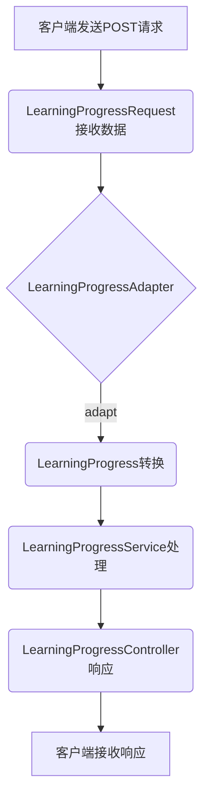

# 0.基础信息

## 0.0代码架构图


## 0.1业务架构图




## 0.2请求测试标准

```java
localhost:8080/AdapterPattern/get-progress
```

POST

```java
{
  "studentId": "12345",
  "progressPercentage": 75.0,
  "completionDate": "2024-12-31"
}

```


# 1.代码分析

## 1.1Pojo设计

```java
package com.xiaoyongcai.io.designmode.pojo.StructuralPatterns.AdapterPattern;

import lombok.AllArgsConstructor;
import lombok.Data;
import lombok.NoArgsConstructor;

@Data
@AllArgsConstructor
@NoArgsConstructor
public class LearningProgress {
    private String studentId;
    private Integer progressPercentage;
    private String completionDate;
    private String AdditionalMessage;

    // getters and setters
}

```

```java
package com.xiaoyongcai.io.designmode.pojo.StructuralPatterns.AdapterPattern;

import lombok.AllArgsConstructor;
import lombok.Data;
import lombok.NoArgsConstructor;

@Data
@AllArgsConstructor
@NoArgsConstructor
public class LearningProgressRequest {
    private String studentId;
    private double progressPercentage;
    private String completionDate;

    // getters and setters
}

```


## 1.2Service设计

```java
package com.xiaoyongcai.io.designmode.Service.StructuralPatterns.AdapterPattern;

import com.xiaoyongcai.io.designmode.pojo.StructuralPatterns.AdapterPattern.LearningProgress;
import com.xiaoyongcai.io.designmode.pojo.StructuralPatterns.AdapterPattern.LearningProgressRequest;

public interface LearningProgressAdapter {
    LearningProgress adapt(LearningProgressRequest request);
}


```

```java
package com.xiaoyongcai.io.designmode.Service.StructuralPatterns.AdapterPattern;

import com.xiaoyongcai.io.designmode.pojo.StructuralPatterns.AdapterPattern.LearningProgress;
import com.xiaoyongcai.io.designmode.pojo.StructuralPatterns.AdapterPattern.LearningProgressRequest;
import lombok.extern.slf4j.Slf4j;
import org.springframework.stereotype.Component;
@Slf4j
@Component
public class LearningProgressAdapterImpl implements LearningProgressAdapter {


    @Override
    public LearningProgress adapt(LearningProgressRequest request) {
        // 假设前端传递的数据中，学习进度是以double类型转换，你要返回给前端的是Integer类型的进度。
        LearningProgress progress = new LearningProgress();
        progress.setStudentId(request.getStudentId());
        progress.setProgressPercentage(Integer.valueOf((int)request.getProgressPercentage()));
        progress.setCompletionDate(request.getCompletionDate());
        progress.setAdditionalMessage("适配器成功将前端传入的double类型进度转化为了Integer类型进度");
        log.info("[适配器模式]：成功获取传入对象"+request.getCompletionDate() +" "+request.getProgressPercentage()+" "+request.getStudentId());
        log.info("[适配器模式]：成功适配完成，产生新对象"+progress.getCompletionDate()+" "+progress.getProgressPercentage()+" "+progress.getStudentId()+" "+progress.getAdditionalMessage());

        return progress;
    }
}

```

```java
package com.xiaoyongcai.io.designmode.Service.StructuralPatterns.AdapterPattern;

import com.xiaoyongcai.io.designmode.pojo.StructuralPatterns.AdapterPattern.LearningProgress;
import com.xiaoyongcai.io.designmode.pojo.StructuralPatterns.AdapterPattern.LearningProgressRequest;
import org.springframework.beans.factory.annotation.Autowired;
import org.springframework.stereotype.Service;

@Service
public class LearningProgressService {

    @Autowired
    private LearningProgressAdapter learningProgressAdapter;

    public LearningProgress getLearningProgress(LearningProgressRequest request) {
        return learningProgressAdapter.adapt(request);
    }
}

```


## 1.3Controller设计

```java
package com.xiaoyongcai.io.designmode.Controller.StructuralPatterns.AdapterPattern;

import com.xiaoyongcai.io.designmode.pojo.StructuralPatterns.AdapterPattern.LearningProgress;
import com.xiaoyongcai.io.designmode.pojo.StructuralPatterns.AdapterPattern.LearningProgressRequest;
import com.xiaoyongcai.io.designmode.pojo.StructuralPatterns.AdapterPattern.LearningProgressService;
import org.springframework.beans.factory.annotation.Autowired;
import org.springframework.http.ResponseEntity;
import org.springframework.web.bind.annotation.PostMapping;
import org.springframework.web.bind.annotation.RequestBody;
import org.springframework.web.bind.annotation.RequestMapping;
import org.springframework.web.bind.annotation.RestController;

@RestController
@RequestMapping("/AdapterPattern")
public class LearningProgressController {

    @Autowired
    private LearningProgressService learningProgressService;

    @PostMapping("/get-progress")
    public ResponseEntity<LearningProgress> getLearningProgress(@RequestBody LearningProgressRequest request) {
        LearningProgress progress = learningProgressService.getLearningProgress(request);
        return ResponseEntity.ok(progress);
    }
}
```

