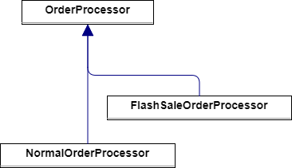
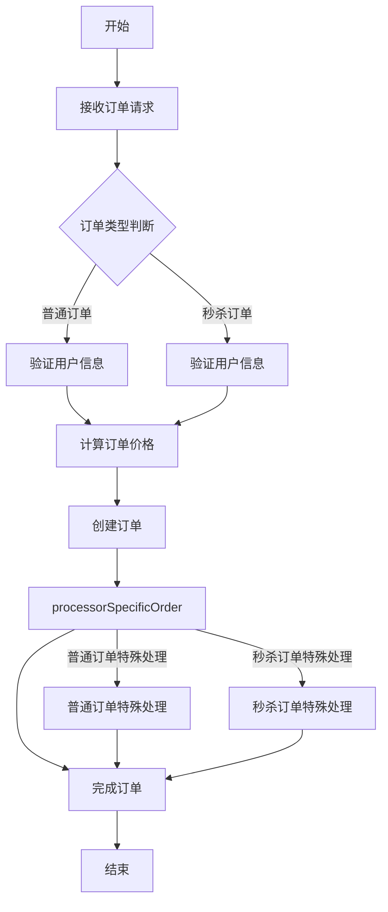

# 0.基础

## 0.0代码架构图




## 0.1业务流程图




## 0.2用于测试的Json

```java
localhost:8080/orders/normal
{
  "orderId": "购物卡A",
  "userId": "普通用户A",  
  "totalPrice": 199.99
}
```

```java
localhost:8080/orders/flashsale
    {
  "orderId": "购物卡B",
  "userId": "秒杀用户B",  
  "totalPrice": 199.99
}
```


# 1.代码

## 1.0:POJO设计

```java
package com.xiaoyongcai.io.designmode.pojo.TemplateMethodPattern;

import lombok.AllArgsConstructor;
import lombok.Data;
import lombok.NoArgsConstructor;

@Data
@AllArgsConstructor
@NoArgsConstructor
public class OrderRequest {
    private String orderId;
    private String userId;
    private double totalPrice;
}

```


## 1.1Service设计

- 注意一点：
- 模板方法的使用final修饰，意味着子类无法继承
- 而钩子方法中又分为普通流程和特殊流程，特殊流程使用abstract修饰，由于OrderProcessor是一个抽象类：而抽象类的子类必须复写父类的抽象方法。因此子类只去实现这个具体的特定业务就可以。
- 倘若不使用模板模式：我们针对普通订单和秒杀订单，都得把验证用户信息，计算订单价格，创建订单，完成订单等通用的过程走一遍，产生了大量代码冗余

```java
package com.xiaoyongcai.io.designmode.Service.TemplateMethodPattern;

import com.xiaoyongcai.io.designmode.pojo.BehavioralPatterns.TemplateMethodPattern.OrderRequest;
import org.springframework.stereotype.Service;

@Service
public abstract class OrderProcessor {
    public final void processorOrder(OrderRequest orderRequest) {
        validateUser(orderRequest);
        calculatePrice(orderRequest);
        createOrder(orderRequest);
        processorSpecificOrder(orderRequest);
        finishOrder(orderRequest);
    }

    private void validateUser(OrderRequest orderRequest) {
        System.out.println("[模版方法模式->通用模版]验证用户信息：" + orderRequest.getUserId());
    }

    private void calculatePrice(OrderRequest orderRequest) {
        System.out.println("[模版方法模式->通用模版]计算订单价格：" + orderRequest.getTotalPrice());
    }

    private void createOrder(OrderRequest orderRequest) {
        System.out.println("[模版方法模式-通用模版]创建订单：" + orderRequest.getOrderId());
    }

    protected abstract void processorSpecificOrder(OrderRequest orderRequest);

    private void finishOrder(OrderRequest orderRequest) {
        System.out.println("[模版方法模式-通用模版]订单处理完成：" + orderRequest.getOrderId());
    }
}

```

```java
package com.xiaoyongcai.io.designmode.Service.TemplateMethodPattern.Impl;

import com.xiaoyongcai.io.designmode.Service.BehavioralPatterns.TemplateMethodPattern.OrderProcessor;
import com.xiaoyongcai.io.designmode.pojo.BehavioralPatterns.TemplateMethodPattern.OrderRequest;
import org.springframework.stereotype.Service;

@Service
public class NormalOrderProcessor extends OrderProcessor {
    @Override
    protected void processorSpecificOrder(OrderRequest orderRequest) {
        System.out.println("[模板方法模式->具体订单处理]普通订单特殊处理：发货处理");
    }
}

```

```java
package com.xiaoyongcai.io.designmode.Service.TemplateMethodPattern.Impl;

import com.xiaoyongcai.io.designmode.Service.BehavioralPatterns.TemplateMethodPattern.OrderProcessor;
import com.xiaoyongcai.io.designmode.pojo.BehavioralPatterns.TemplateMethodPattern.OrderRequest;
import org.springframework.stereotype.Service;

@Service
public class FlashSaleOrderProcessor extends OrderProcessor {
    @Override
    protected void processorSpecificOrder(OrderRequest orderRequest) {
        System.out.println("[模板方法模式->具体订单处理]:秒杀订单处理：因为是秒杀订单，因此需要执行库存检查的业务");
    }
}

```


## 1.2Controller设计

```java
package com.xiaoyongcai.io.designmode.Controller.TemplateMethodPattern;

import com.xiaoyongcai.io.designmode.Service.BehavioralPatterns.TemplateMethodPattern.Impl.FlashSaleOrderProcessor;
import com.xiaoyongcai.io.designmode.Service.BehavioralPatterns.TemplateMethodPattern.Impl.NormalOrderProcessor;
import com.xiaoyongcai.io.designmode.pojo.BehavioralPatterns.TemplateMethodPattern.OrderRequest;
import org.springframework.beans.factory.annotation.Autowired;
import org.springframework.http.ResponseEntity;
import org.springframework.web.bind.annotation.PostMapping;
import org.springframework.web.bind.annotation.RequestBody;
import org.springframework.web.bind.annotation.RequestMapping;
import org.springframework.web.bind.annotation.RestController;

@RestController
@RequestMapping("/orders")
public class TemplateMethodPatternOrderController {

    @Autowired
    private NormalOrderProcessor normalOrderProcessor;

    @Autowired
    private FlashSaleOrderProcessor flashSaleOrderProcessor;

    // 创建普通订单
    @PostMapping("/normal")
    public ResponseEntity<String> createNormalOrder(@RequestBody OrderRequest orderRequest) {
        normalOrderProcessor.processorOrder(orderRequest);
        return ResponseEntity.ok("普通订单处理完成");
    }

    // 创建秒杀订单
    @PostMapping("/flashsale")
    public ResponseEntity<String> createFlashSaleOrder(@RequestBody OrderRequest orderRequest) {
        flashSaleOrderProcessor.processorOrder(orderRequest);
        return ResponseEntity.ok("秒杀订单处理完成");
    }
}

```

