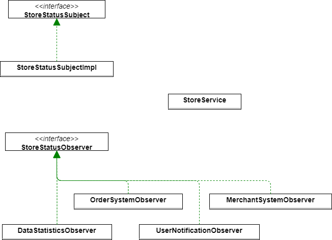
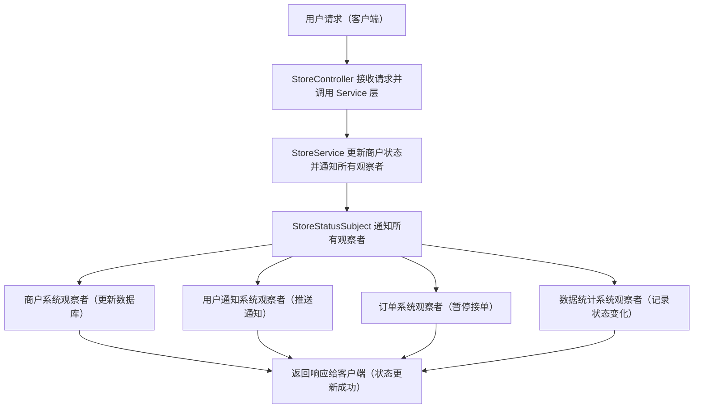

# 0.预备工作

## 0.1用于测试的JSON格式

```json
{
  "storeStatus": "打烊"
}

```

```json
{
  "storeStatus": "营业"
}

```

```java
2024-11-22 16:13:12.115  INFO 18852 --- [nio-8080-exec-2] c.x.i.d.S.O.O.DataStatisticsObserver     : 数据统计系统收到商户状态变更:商户状态更新为打烊
2024-11-22 16:13:12.115  INFO 18852 --- [nio-8080-exec-2] c.x.i.d.S.O.O.MerchantSystemObserver     : 商户系统收到商户状态变更通知：商户状态更新为打烊
2024-11-22 16:13:12.115  INFO 18852 --- [nio-8080-exec-2] c.x.i.d.S.O.O.OrderSystemObserver        : 订单系统收到商户状态变更通知：商户状态更新为打烊
2024-11-22 16:13:12.115  INFO 18852 --- [nio-8080-exec-2] c.x.i.d.S.O.O.OrderSystemObserver        : 商户暂停接单，停止订单处理
2024-11-22 16:13:12.115  INFO 18852 --- [nio-8080-exec-2] c.x.i.d.S.O.O.UserNotificationObserver   : 用户通知系统收到商户状态变更通知:商户状态更新为打烊
2024-11-22 16:13:12.115  INFO 18852 --- [nio-8080-exec-2] c.x.i.d.C.O.StoreController              : Controller层可以正常工作
```

```java
2024-11-22 16:13:57.013  INFO 18852 --- [nio-8080-exec-1] c.x.i.d.S.O.O.DataStatisticsObserver     : 数据统计系统收到商户状态变更:商户状态更新为营业
2024-11-22 16:13:57.013  INFO 18852 --- [nio-8080-exec-1] c.x.i.d.S.O.O.MerchantSystemObserver     : 商户系统收到商户状态变更通知：商户状态更新为营业
2024-11-22 16:13:57.013  INFO 18852 --- [nio-8080-exec-1] c.x.i.d.S.O.O.OrderSystemObserver        : 订单系统收到商户状态变更通知：商户状态更新为营业
2024-11-22 16:13:57.013  INFO 18852 --- [nio-8080-exec-1] c.x.i.d.S.O.O.OrderSystemObserver        : 商户开始接单，开始订单处理
2024-11-22 16:13:57.013  INFO 18852 --- [nio-8080-exec-1] c.x.i.d.S.O.O.UserNotificationObserver   : 用户通知系统收到商户状态变更通知:商户状态更新为营业
2024-11-22 16:13:57.013  INFO 18852 --- [nio-8080-exec-1] c.x.i.d.C.O.StoreController              : Controller层可以正常工作
```

## 0.2代码结构与流程图分析







# 1.代码实现

## 1.1:POJO类实现

```java
package com.xiaoyongcai.io.designmode.pojo.ObserverPattern;

import lombok.AllArgsConstructor;
import lombok.Data;
import lombok.NoArgsConstructor;
// 请求参数类
@Data
@AllArgsConstructor
@NoArgsConstructor
public class StoreStatusRequest {
    private String storeStatus;  // 商户的状态
}
```

```java
package com.xiaoyongcai.io.designmode.pojo.ObserverPattern;

import lombok.AllArgsConstructor;
import lombok.Data;

@Data
@AllArgsConstructor
public class StoreStatusResponse {
    private String message;  // 响应消息
    private int code;        // 响应码
}
```


## 1.2:Observer接口与Impl

```java
package com.xiaoyongcai.io.designmode.pojo.ObserverPattern;

import lombok.AllArgsConstructor;
import lombok.Data;

@Data
@AllArgsConstructor
public class StoreStatusResponse {
    private String message;  // 响应消息
    private int code;        // 响应码
}
```

```java
package com.xiaoyongcai.io.designmode.Service.ObserverPattern.ObserverImpl;

import com.xiaoyongcai.io.designmode.Service.ObserverPattern.StoreStatusObserver;
import lombok.extern.slf4j.Slf4j;
import org.springframework.stereotype.Service;

@Slf4j
@Service
public class DataStatisticsObserver implements StoreStatusObserver {
    @Override
    public void update(String storeStatus) {
        log.info("数据统计系统收到商户状态变更:商户状态更新为"+storeStatus);
        //执行数据统计的代码，为某状态的统计参数增加一个当前的storestatus
    }
}

```

```java
package com.xiaoyongcai.io.designmode.Service.ObserverPattern.ObserverImpl;

import com.xiaoyongcai.io.designmode.Service.ObserverPattern.StoreStatusObserver;
import lombok.extern.slf4j.Slf4j;
import org.springframework.stereotype.Service;

@Slf4j
@Service
public class MerchantSystemObserver implements StoreStatusObserver {
    @Override
    public void update(String storeStatus) {
        log.info("商户系统收到商户状态变更通知：商户状态更新为"+storeStatus);
        //这里进行商户系统的处理：比如更新数据库
    }
}

```

```java
package com.xiaoyongcai.io.designmode.Service.ObserverPattern.ObserverImpl;

import com.xiaoyongcai.io.designmode.Service.ObserverPattern.StoreStatusObserver;
import lombok.extern.slf4j.Slf4j;
import org.springframework.stereotype.Service;

@Service
@Slf4j
public class OrderSystemObserver implements StoreStatusObserver {
    @Override
    public void update(String storeStatus) {
      log.info("订单系统收到商户状态变更通知：商户状态更新为"+storeStatus);
      if("打烊".equals(storeStatus)){
          log.info("商户暂停接单，停止订单处理");
      }else if("营业".equals(storeStatus)){
          log.info("商户开始接单，开始订单处理");
      }
    }
}

```

```java
package com.xiaoyongcai.io.designmode.Service.ObserverPattern.ObserverImpl;

import com.xiaoyongcai.io.designmode.Service.ObserverPattern.StoreStatusObserver;
import lombok.extern.slf4j.Slf4j;
import org.springframework.stereotype.Service;

@Service
@Slf4j
public class UserNotificationObserver implements StoreStatusObserver {
    @Override
    public void update(String storeStatus) {
      log.info("用户通知系统收到商户状态变更通知:商户状态更新为"+storeStatus);
      //在此实现用户通知的处理，比如通过消息队列发送短信or通知
    }
}

```


## 1.3:Subject接口与Impl

```java
package com.xiaoyongcai.io.designmode.Service.ObserverPattern;

public interface StoreStatusSubject {
    void addObserver(StoreStatusObserver observer);
    void removeObserver(StoreStatusObserver observer);
    void notifyObservers();
    void setStoreStatus(String storeStatus);
}

```

```java
package com.xiaoyongcai.io.designmode.Service.ObserverPattern.SubjectImpl;

import com.xiaoyongcai.io.designmode.Service.ObserverPattern.StoreStatusObserver;
import com.xiaoyongcai.io.designmode.Service.ObserverPattern.StoreStatusSubject;
import org.springframework.beans.factory.annotation.Autowired;
import org.springframework.stereotype.Service;

import java.util.ArrayList;
import java.util.List;

@Service
public class StoreStatusSubjectImpl implements StoreStatusSubject
{
    @Autowired
    private List<StoreStatusObserver> observers = new ArrayList<StoreStatusObserver>();
    private String storeStatus;


    @Override
    public void addObserver(StoreStatusObserver observer) {
        observers.add(observer);
    }

    @Override
    public void removeObserver(StoreStatusObserver observer) {
        observers.remove(observer);
    }

    @Override
    public void notifyObservers() {
        for(StoreStatusObserver observer : observers) {
            observer.update(storeStatus);
        }
    }
    @Override
    public void setStoreStatus(String storeStatus) {
        this.storeStatus = storeStatus;
        notifyObservers();
    }
}

```


## 1.4:StoreService结合Object和Subject

```java
package com.xiaoyongcai.io.designmode.Service.ObserverPattern;

import org.springframework.beans.factory.annotation.Autowired;
import org.springframework.stereotype.Service;

@Service
public class StoreService {
    private final StoreStatusSubject storeStatusSubject;

    @Autowired
    public StoreService(StoreStatusSubject storeStatusSubject) {
        this.storeStatusSubject = storeStatusSubject;
    }
    //更新商户状态并且通知所有观察者
    public void updateStoreStatus(String storeStatus){
        storeStatusSubject.setStoreStatus(storeStatus);
    }
}

```


## 1.5:Controller层调用

```java
package com.xiaoyongcai.io.designmode.Controller.ObserverPattern;

import com.xiaoyongcai.io.designmode.Service.ObserverPattern.StoreService;
import com.xiaoyongcai.io.designmode.pojo.ObserverPattern.StoreStatusRequest;
import com.xiaoyongcai.io.designmode.pojo.ObserverPattern.StoreStatusResponse;
import org.slf4j.Logger;
import org.slf4j.LoggerFactory;
import org.springframework.beans.factory.annotation.Autowired;
import org.springframework.web.bind.annotation.*;

@RestController
@RequestMapping("/store")
public class StoreController {
    private static final Logger log = LoggerFactory.getLogger(StoreController.class);
    @Autowired
    private StoreController storeController;
    @Autowired
    private StoreService storeService;

    @PostMapping("/update-status")
    public StoreStatusResponse updateStoreStatus(@RequestBody StoreStatusRequest request){
        storeService.updateStoreStatus(request.getStoreStatus());
        log.info("Controller层可以正常工作");
        return new StoreStatusResponse("状态更新成功",200);
    }
}

```

