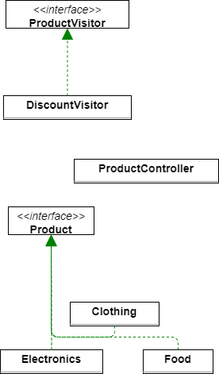
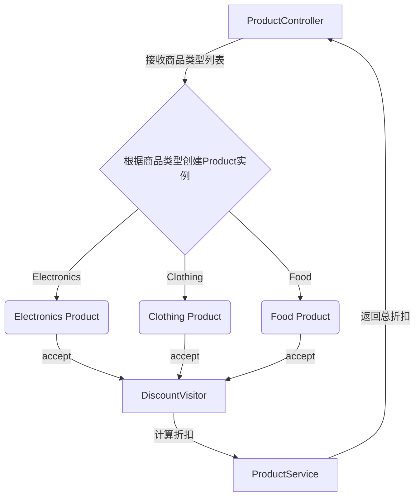

# 0.基础

## 0.0解决的痛点

​	**它可以在不修改原有类的情况下，扩展新的操作，而策略模式则需要改变上下文类来引入新的策略。**

- **扩展性更强**
  - 访问者模式使得你可以在不修改现有类的情况下添加新的操作。假设你有多个对象构成的复杂结构，并且要在这些对象上执行不同的操作。
  - 使用访问者模式，你可以为每个对象定义一个访问者，而每次需要添加新的操作时，只需要增加一个新的访问者类。这样，原有类不会被修改，**符合开闭原则（对扩展开放，对修改关闭）。**
  - 相反，策略模式更多是通过替换算法来改变行为。如果你的业务逻辑复杂，需要在同一个对象中实现多个策略，频繁地改变策略可能会导致对象内部逻辑变得非常复杂，增加维护成本。
- **职责单一，逻辑分离**
  - 访问者模式将行为与对象结构分离，访问者本身只关心如何**对不同对象执行操作**，而不需要关心对象的具体实现。这种方式将操作逻辑与数据结构解耦，符**合单一职责原**则。
  - 策略模式中，每种**策略**会嵌入到**目标对象**中，这会使得目标对象承担过多的责任，尤其是在需要处理大量策略的情况下，会导致对象变得非常臃肿。
- **操作集中统一管理**
  - 使用访问者模式时，所有的**操作都集中在访问者类中进行管理。**
  - 假设有多个元素需要执行不同的操作，访问者模式将这些操作集中到访问者中，避免了分散在各个策略中的问题，便于管理和维护。
  - 策略模式则往往需要将每个策略分散在不同的策略类中，随着策略增多，管理和维护会变得越来越困难，尤其是当策略之间有依赖或交互时，复杂性会迅速增加。
- **适合复杂结构对象的处理**
  - 访问者模式特别适合在对象结构复杂且需要遍历的场景中使用。
  - 例如，树形结构或对象图的遍历，这时每个节点的处理逻辑可以独立出来，并通过访问者来实现。
  - 访问者可以对这些节点类型的元素进行访问和操作，无需修改元素类本身。
  - 策略模式一般用于动态地改变同一对象的行为，不适合处理复杂的对象结构，特别是当需要在多个元素中进行遍历和操作时，策略模式会显得不够灵活。
- 总结：
  - 访问者模式更适合在你需要对复杂结构的对象执行多个操作，并且希望操作与对象本身分离的场景。
  - 它更方便扩展，避免了复杂的继承结构或不断修改已有类。
  - 而策略模式则适合于在单一对象上动态替换行为，但对于复杂对象结构的处理往往会导致逻辑分散，扩展性差。

## 0.1代码结构图




## 0.2业务流程图




## 0.3请求Json

```json
localhost:8080/VisitorPattern/calculateDiscount
    POST类型
    ["electronics", "clothing", "food"]

```


# 1.代码结构

## 1.1Pojo

```java
package com.xiaoyongcai.io.designmode.pojo.VisitorPattern;

import com.xiaoyongcai.io.designmode.pojo.BehavioralPatterns.VisitorPattern.ProductVisitor;

public interface Product {
    void accept(ProductVisitor visitor);
}

```

```java
package com.xiaoyongcai.io.designmode.pojo.VisitorPattern;

import com.xiaoyongcai.io.designmode.pojo.BehavioralPatterns.VisitorPattern.ProductImpl.Clothing;
import com.xiaoyongcai.io.designmode.pojo.BehavioralPatterns.VisitorPattern.ProductImpl.Electronics;
import com.xiaoyongcai.io.designmode.pojo.BehavioralPatterns.VisitorPattern.ProductImpl.Food;

public interface ProductVisitor {
    void visit(Electronics electronics);

    void visit(Clothing clothing);

    void visit(Food food);
}

```

```java
package com.xiaoyongcai.io.designmode.pojo.VisitorPattern.ProductImpl;

import com.xiaoyongcai.io.designmode.pojo.BehavioralPatterns.VisitorPattern.Product;
import com.xiaoyongcai.io.designmode.pojo.BehavioralPatterns.VisitorPattern.ProductVisitor;
import lombok.AllArgsConstructor;
import lombok.Data;
import lombok.NoArgsConstructor;

@Data
@AllArgsConstructor
@NoArgsConstructor
public class Clothing implements Product {
    private double price;

    @Override
    public void accept(ProductVisitor visitor) {
        visitor.visit(this);  // 传递给访问者
    }
}

```

```java
package com.xiaoyongcai.io.designmode.pojo.VisitorPattern.ProductImpl;

import com.xiaoyongcai.io.designmode.pojo.BehavioralPatterns.VisitorPattern.Product;
import com.xiaoyongcai.io.designmode.pojo.BehavioralPatterns.VisitorPattern.ProductVisitor;
import lombok.AllArgsConstructor;
import lombok.Data;
import lombok.NoArgsConstructor;

@Data
@AllArgsConstructor
@NoArgsConstructor
public class Electronics implements Product {
    private double price;

    @Override
    public void accept(ProductVisitor visitor) {
        visitor.visit(this);  // 传递给访问者
    }
}

```

```java
package com.xiaoyongcai.io.designmode.pojo.VisitorPattern.ProductImpl;

import com.xiaoyongcai.io.designmode.pojo.BehavioralPatterns.VisitorPattern.Product;
import com.xiaoyongcai.io.designmode.pojo.BehavioralPatterns.VisitorPattern.ProductVisitor;
import lombok.AllArgsConstructor;
import lombok.Data;
import lombok.NoArgsConstructor;

@Data
@AllArgsConstructor
@NoArgsConstructor
public class Food implements Product {
    private double price;

    @Override
    public void accept(ProductVisitor visitor) {
        visitor.visit(this);  // 传递给访问者
    }
}

```

```java
package com.xiaoyongcai.io.designmode.pojo.VisitorPattern.VisitorImpl;

import com.xiaoyongcai.io.designmode.pojo.BehavioralPatterns.VisitorPattern.ProductImpl.Clothing;
import com.xiaoyongcai.io.designmode.pojo.BehavioralPatterns.VisitorPattern.ProductImpl.Electronics;
import com.xiaoyongcai.io.designmode.pojo.BehavioralPatterns.VisitorPattern.ProductImpl.Food;
import com.xiaoyongcai.io.designmode.pojo.BehavioralPatterns.VisitorPattern.ProductVisitor;
import lombok.AllArgsConstructor;
import lombok.Data;
import lombok.NoArgsConstructor;
import lombok.extern.slf4j.Slf4j;

@Data
@AllArgsConstructor
@NoArgsConstructor
@Slf4j
public class DiscountVisitor implements ProductVisitor {
    private double totalDiscount = 0;

    @Override
    public void visit(Electronics electronics) {
        //电子产品打八折
        totalDiscount += electronics.getPrice() * 0.2;
        log.info("[访问者模式]：电子产品打8折后价格为" + electronics.getPrice() * 0.2 + "原价为" + electronics.getPrice());

    }

    @Override
    public void visit(Clothing clothing) {
        //衣物商品打7折
        totalDiscount += clothing.getPrice() * 0.3;
        log.info("[访问者模式]衣物商品打7折后价格为" + clothing.getPrice() * 0.2 + "原价为" + clothing.getPrice());
    }

    @Override
    public void visit(Food food) {
        //食品商品打9折
        totalDiscount += food.getPrice() * 0.1;
        log.info("[访问者模式]食品商品打9折后价格为" + food.getPrice() * 0.2 + "原价为" + food.getPrice());
    }
}

```


## 1.2Service

```java
package com.xiaoyongcai.io.designmode.Service.VisitorPattern;

import com.xiaoyongcai.io.designmode.pojo.BehavioralPatterns.VisitorPattern.Product;
import com.xiaoyongcai.io.designmode.pojo.BehavioralPatterns.VisitorPattern.VisitorImpl.DiscountVisitor;
import org.springframework.stereotype.Service;

import java.util.List;

@Service
public class ProductService {

    public double calculateTotalDiscount(List<Product> products) {
        // 创建一个DiscountVisitor实例
        DiscountVisitor discountVisitor = new DiscountVisitor();

        // 遍历每个商品，执行折扣计算
        for (Product product : products) {
            product.accept(discountVisitor);
        }

        // 返回总折扣
        return discountVisitor.getTotalDiscount();
    }
}

```


## 1.3Controller

```java
package com.xiaoyongcai.io.designmode.Controller.VisitorPattern;

import com.xiaoyongcai.io.designmode.Service.BehavioralPatterns.VisitorPattern.ProductService;
import com.xiaoyongcai.io.designmode.pojo.BehavioralPatterns.VisitorPattern.Product;
import com.xiaoyongcai.io.designmode.pojo.BehavioralPatterns.VisitorPattern.ProductImpl.Clothing;
import com.xiaoyongcai.io.designmode.pojo.BehavioralPatterns.VisitorPattern.ProductImpl.Electronics;
import com.xiaoyongcai.io.designmode.pojo.BehavioralPatterns.VisitorPattern.ProductImpl.Food;
import org.springframework.beans.factory.annotation.Autowired;
import org.springframework.web.bind.annotation.*;

import java.util.ArrayList;
import java.util.List;

@RestController
@RequestMapping("VisitorPattern")
public class ProductController {

  @Autowired
  private ProductService productService;

  @PostMapping("/calculateDiscount")
  public String calculateDiscount(@RequestBody List<String> productTypes) {
    List<Product> products = new ArrayList<>();

    // 根据传入的商品类型，创建不同的商品实例
    for (String type : productTypes) {
      switch (type) {
        case "electronics":
          products.add(new Electronics(100));  // 假设价格是100
          break;
        case "clothing":
          products.add(new Clothing(150));    // 假设价格是150
          break;
        case "food":
          products.add(new Food(50));         // 假设价格是50
          break;
      }
    }
    productService.calculateTotalDiscount(products);
    // 调用Service层计算折扣
    return "请在控制台检查访问者模式是否工作";
  }
}

```

