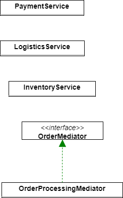
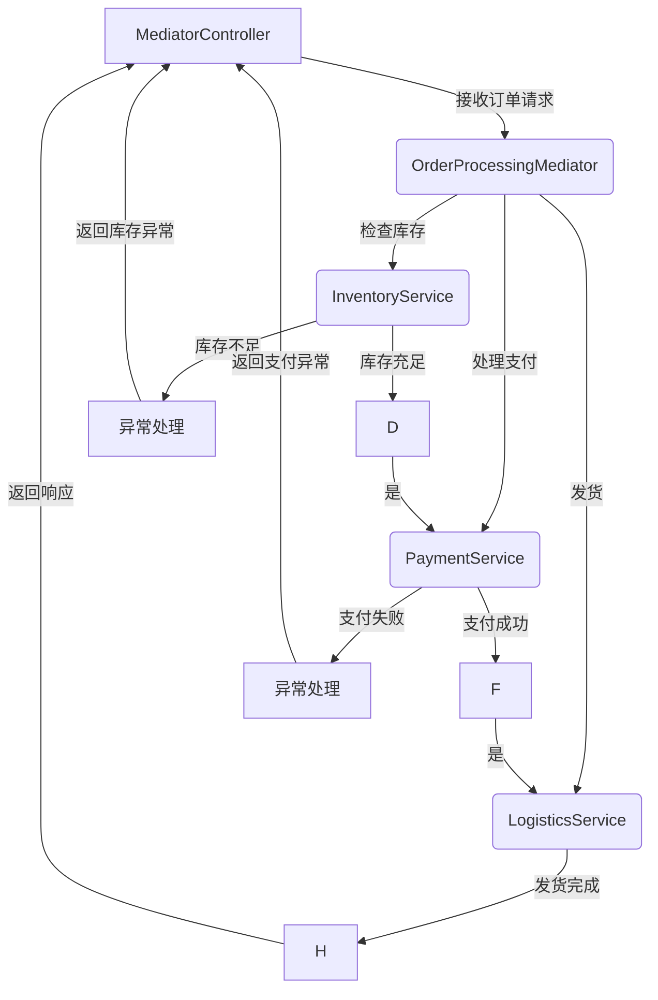

# 0.基础信息

## 0.1中介者模式的定义

**中间者模式（Mediator Pattern）解决的痛点**

- 中间者模式是一种行为型设计模式，旨在通过引入一个中间者对象来减少各个组件之间的直接交互。
- 传统的系统中，多个对象相互交互时，会导致系统复杂性急剧增加，特别是当系统规模扩大，组件之间的依赖关系逐渐变得错综复杂时，代码的可维护性、可扩展性也会受到影响。此时，中间者模式便显得尤为重要。

**中间者模式的痛点**

1. **高耦合度**：在传统的设计中，每个组件之间往往直接相互依赖。如果有一个组件发生变化，可能会导致其他多个组件的修改，从而使得系统变得脆弱。随着功能的增加，模块之间的依赖关系会迅速复杂化。
2. **难以维护和扩展**：由于组件间的相互调用，某些功能的修改可能需要修改多个地方。随着业务的扩展，维护变得越来越困难。
3. **职责不清**：不同模块之间往往没有明确的分工，导致业务逻辑在多个地方冗余，系统的理解和修改会变得混乱。

**中间者模式如何解决这些痛点**

中间者模式通过引入一个中介者类，所有对象间的交互都通过中介者来协调。这样，每个对象只需要知道如何通过中介者与其他对象交互，而不需要直接与其他对象通信。它的核心思想是**解耦**，降低了对象之间的依赖关系，使得系统更加灵活、易于维护。

- **减少对象之间的依赖**：中介者模式使得对象之间的通信通过一个中心化的中介者进行，避免了多个对象之间相互调用，减少了耦合度。
- **职责分离**：中介者集中处理业务逻辑，避免了重复的逻辑代码分散在多个对象中。
- **提高系统可扩展性**：由于每个对象只与中介者交互，因此添加新的功能或修改现有功能时，只需要修改中介者，而不需要修改多个对象的交互逻辑。

**真实业务场景：电商订单管理**

- 假设我们在构建一个电商平台的订单管理系统。该系统中，订单涉及到多个模块，如库存管理、支付、物流、客户服务等。这些模块需要相互协作来完成订单的处理，而在传统设计中，各个模块之间可能会直接交互，导致耦合度高，维护困难。
- 使用中间者模式后，所有的模块通过一个“订单处理中介者”来协作，避免了直接依赖，提高了系统的可维护性和可扩展性。

**总结对比表**

| **特性**     | **中介者模式**                                 | **观察者模式**                                   |
| ------------ | ---------------------------------------------- | ------------------------------------------------ |
| **目的**     | 通过引入中介者减少对象间的直接交互，降低耦合度 | 实现一对多的依赖关系，自动通知观察者状态变化     |
| **结构**     | 中介者对象协调多个同事对象的交互               | 主题对象通知多个观察者状态变化                   |
| **控制流**   | 中介者处理所有交互逻辑，**中心化控制**         | **主题**状态变化时通知**观察者**，观察者响应变化 |
| **应用场景** | 复杂交互系统，如订单处理系统、聊天室等         | 一对多事件驱动场景，如UI更新、天气变化通知等     |
| **耦合度**   | 组件通过中介者协作，减少直接依赖               | 主题和观察者之间耦合度较低                       |
| **灵活性**   | 通过修改中介者可以轻松扩展或修改交互逻辑       | 新的观察者可以随时加入，不影响主题对象           |

**选择哪种模式**

- **中介者模式**：适用于系统中有多个组件，需要复杂的交互协调，但又不希望这些组件之间紧密耦合的场景。
- **观察者模式**：适用于**事件驱动**、**一对多通知**的场景，特别是当主题状态变化时需要通知多个观察者并让它们进行更新的场合。

## 0.2代码结构



## 0.3业务结构




## 0.4请求测试格式

localhost:8080/MediatorPattern/process

```json
{
    "id": 123,
    "customerName": "John Doe",
    "items": ["item1", "item2"]
}

```


# 1.代码细节分析

## 1.1Pojo分析

```java
package com.xiaoyongcai.io.designmode.pojo.BehavioralPatterns.MediatorPattern;
	
import lombok.AllArgsConstructor;
import lombok.Data;
import lombok.NoArgsConstructor;

import java.util.List;

@Data
@AllArgsConstructor
@NoArgsConstructor
public class MediatorOrder {
    private Long id;
    private String customerName;
    private List<String> items;
}

```


## 1.2Service分析

```java
package com.xiaoyongcai.io.designmode.Service.BehavioralPatterns.MediatorPattern;

import com.xiaoyongcai.io.designmode.pojo.BehavioralPatterns.MediatorPattern.MediatorOrder;

public interface OrderMediator {
    void processOrder(MediatorOrder order);
}

```

```java
package com.xiaoyongcai.io.designmode.Service.BehavioralPatterns.MediatorPattern.TrueService;

import com.xiaoyongcai.io.designmode.pojo.BehavioralPatterns.MediatorPattern.MediatorOrder;
import lombok.extern.slf4j.Slf4j;
import org.springframework.stereotype.Service;
@Slf4j
@Service
public class InventoryService {
    public boolean checkStock(MediatorOrder order){
        //检查库存的逻辑
        log.info("[中介者模式]：模拟检查库存"+" 下单人："+order.getCustomerName()+" 订单号："+order.getId()+" 下单商品："+order.getItems());
        return true;
    }
}

```

```java
package com.xiaoyongcai.io.designmode.Service.BehavioralPatterns.MediatorPattern.TrueService;

import com.xiaoyongcai.io.designmode.pojo.BehavioralPatterns.MediatorPattern.MediatorOrder;
import lombok.extern.slf4j.Slf4j;
import org.springframework.stereotype.Service;
@Slf4j
@Service
public class LogisticsService {
    public void shipOrder(MediatorOrder order){
        //假设发货的逻辑
        log.info("[中介者模式]：模拟发货逻辑中"+" 下单人："+order.getCustomerName()+" 订单号："+order.getId()+" 下单商品："+order.getItems());
    }
}

```

```java
package com.xiaoyongcai.io.designmode.Service.BehavioralPatterns.MediatorPattern.TrueService;

import com.xiaoyongcai.io.designmode.pojo.BehavioralPatterns.MediatorPattern.MediatorOrder;
import lombok.extern.slf4j.Slf4j;
import org.springframework.stereotype.Service;
@Slf4j
@Service
public class PaymentService {
    public boolean processPayment(MediatorOrder order){
        //处理支付的逻辑
        log.info("[中介者模式]：模拟支付逻辑中"+" 下单人："+order.getCustomerName()+" 订单号："+order.getId()+" 下单商品："+order.getItems());
        return true;
    }
}
		
```

```java
    package com.xiaoyongcai.io.designmode.Service.BehavioralPatterns.MediatorPattern;

    import com.xiaoyongcai.io.designmode.Service.BehavioralPatterns.MediatorPattern.TrueService.InventoryService;
    import com.xiaoyongcai.io.designmode.Service.BehavioralPatterns.MediatorPattern.TrueService.LogisticsService;
    import com.xiaoyongcai.io.designmode.Service.BehavioralPatterns.MediatorPattern.TrueService.PaymentService;
    import com.xiaoyongcai.io.designmode.pojo.BehavioralPatterns.MediatorPattern.MediatorOrder;
    import lombok.extern.slf4j.Slf4j;
    import org.springframework.stereotype.Service;
    @Slf4j
    @Service
    public class OrderProcessingMediator implements OrderMediator{
        private final InventoryService inventoryService;
        private final PaymentService paymentService;
        private final LogisticsService logisticsService;

        public OrderProcessingMediator(InventoryService inventoryService, PaymentService paymentService, LogisticsService logisticsService) {
            this.inventoryService = inventoryService;
            this.paymentService = paymentService;
            this.logisticsService = logisticsService;
        }

        @Override
        public void processOrder(MediatorOrder order) {
            // 库存检查
            if (inventoryService.checkStock(order)) {
                // 进行支付处理
                if (paymentService.processPayment(order)) {
                    // 发货
                    logisticsService.shipOrder(order);
                } else {
                    throw new RuntimeException("[中介者模式]:捕获支付异常" + order.getId());
                }
            } else {
                throw new RuntimeException("[中介者模式]:捕获库存检查异常 " + order.getId());
            }
        }
    }

```


## 1.3Controller分析

```java
package com.xiaoyongcai.io.designmode.Controller.BehavioralPatterns.MediatorPattern;

import com.xiaoyongcai.io.designmode.Service.BehavioralPatterns.MediatorPattern.OrderMediator;
import com.xiaoyongcai.io.designmode.pojo.BehavioralPatterns.MediatorPattern.MediatorOrder;
import org.springframework.beans.factory.annotation.Autowired;
import org.springframework.http.HttpStatus;
import org.springframework.http.ResponseEntity;
import org.springframework.web.bind.annotation.PostMapping;
import org.springframework.web.bind.annotation.RequestBody;
import org.springframework.web.bind.annotation.RequestMapping;
import org.springframework.web.bind.annotation.RestController;

@RestController
@RequestMapping("/MediatorPattern")
public class MediatorController {
    private final OrderMediator orderMediator;

    @Autowired
    public MediatorController(OrderMediator orderMediator) {
        this.orderMediator = orderMediator;
    }

    @PostMapping("/process")
    public ResponseEntity<String> processOrder(@RequestBody MediatorOrder order) {
        try {
            orderMediator.processOrder(order);
            return ResponseEntity.ok("订单已经交给后端处理");
        } catch (Exception e) {
            return ResponseEntity.status(HttpStatus.BAD_REQUEST).body(e.getMessage());
        }
    }
}

```

