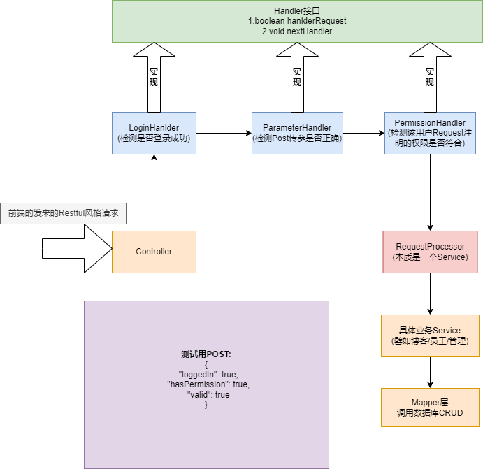

# 1.责任链场景图



# 2.责任链业务功能分析

责任链模式（Chain of Responsibility Pattern）是一种行为型设计模式，它允许将请求沿着处理链传递，直到有对象处理这个请求为止。该模式旨在解耦请求发送者和接收者，让多个对象都有机会处理请求，避免请求发送者与具体的处理对象耦合。

### 责任链模式的基本概念
责任链模式主要有以下几个要点：
1. **请求发送者**：发出请求的对象。
2. **处理者**：每个处理者都可以处理请求，也可以将请求传递给链中的下一个处理者。
3. **链**：处理者按顺序组成一个链条，每个处理者都有一个对下一个处理者的引用。

### 责任链模式的应用场景
- **日志处理**：不同的日志级别（如调试、信息、警告、错误）通过责任链模式进行处理，只有满足条件的日志被处理。
- **权限验证**：多个权限检查依次进行验证，直到一个验证失败或通过。
- **审批流程**：审批流程中，每个处理者（如主管、经理等）依次处理，直到一个审批通过。

### 在 Spring Boot 项目中使用责任链模式

假设我们要在 Spring Boot 项目中实现一个简单的请求处理链，用于验证用户请求的合法性（例如：检查请求是否符合某些条件，如是否登录、是否有权限、请求参数是否正确等）。我们可以通过责任链模式来实现这些请求的顺序验证。

### 步骤 1: 定义 `Handler` 接口

首先，我们定义一个 `Handler` 接口，表示处理请求的责任链中的每个节点。

```java
public interface Handler {
    // 每个Handler都需要处理的业务逻辑
    boolean handleRequest(Request request);

    // 设置下一个处理器
    void setNextHandler(Handler nextHandler);
}
```

### 步骤 2: 实现具体的 `Handler`

接下来，我们实现几个具体的处理器，表示责任链中的各个环节。例如，用户登录检查、权限检查和参数校验。

```java
public class LoginHandler implements Handler {
    private Handler nextHandler;

    @Override
    public boolean handleRequest(Request request) {
        // 检查用户是否登录
        if (request.isLoggedIn()) {
            System.out.println("Login successful.");
            if (nextHandler != null) {
                return nextHandler.handleRequest(request);
            }
            return true; // 登录通过，继续处理
        }
        System.out.println("User not logged in.");
        return false; // 登录失败，不处理请求
    }

    @Override
    public void setNextHandler(Handler nextHandler) {
        this.nextHandler = nextHandler;
    }
}

public class PermissionHandler implements Handler {
    private Handler nextHandler;

    @Override
    public boolean handleRequest(Request request) {
        // 检查用户权限
        if (request.hasPermission()) {
            System.out.println("Permission granted.");
            if (nextHandler != null) {
                return nextHandler.handleRequest(request);
            }
            return true; // 权限通过，继续处理
        }
        System.out.println("Permission denied.");
        return false; // 没有权限，终止请求
    }

    @Override
    public void setNextHandler(Handler nextHandler) {
        this.nextHandler = nextHandler;
    }
}

public class ParameterHandler implements Handler {
    private Handler nextHandler;

    @Override
    public boolean handleRequest(Request request) {
        // 检查请求参数是否有效
        if (request.isValid()) {
            System.out.println("Parameters valid.");
            if (nextHandler != null) {
                return nextHandler.handleRequest(request);
            }
            return true; // 参数有效，继续处理
        }
        System.out.println("Invalid parameters.");
        return false; // 参数无效，终止请求
    }

    @Override
    public void setNextHandler(Handler nextHandler) {
        this.nextHandler = nextHandler;
    }
}
```

### 步骤 3: 创建 `Request` 类

`Request` 类用于封装请求数据。在本例中，我们需要检查用户是否登录、是否有权限、请求参数是否有效。

```java
public class Request {
    private boolean loggedIn;
    private boolean hasPermission;
    private boolean valid;

    // 构造方法和 getter/setter
    public Request(boolean loggedIn, boolean hasPermission, boolean valid) {
        this.loggedIn = loggedIn;
        this.hasPermission = hasPermission;
        this.valid = valid;
    }

    public boolean isLoggedIn() {
        return loggedIn;
    }

    public boolean hasPermission() {
        return hasPermission;
    }

    public boolean isValid() {
        return valid;
    }
}
```

### 步骤 4: 设置责任链

在应用程序中，创建责任链并设置每个处理器的顺序。你可以将责任链的创建放在一个配置类或者服务中。

```java
import org.springframework.stereotype.Service;

@Service
public class RequestProcessor {

    private final Handler loginHandler;
    private final Handler permissionHandler;
    private final Handler parameterHandler;

    public RequestProcessor() {
        // 创建处理器
        this.loginHandler = new LoginHandler();
        this.permissionHandler = new PermissionHandler();
        this.parameterHandler = new ParameterHandler();

        // 设置责任链
        loginHandler.setNextHandler(permissionHandler);
        permissionHandler.setNextHandler(parameterHandler);
    }

    public boolean processRequest(Request request) {
        return loginHandler.handleRequest(request);
    }
}
```

### 步骤 5: 创建 Controller

通过一个简单的 `RestController` 接口来模拟请求处理，Spring Boot 会通过 `RequestProcessor` 来处理请求。

```java
import org.springframework.web.bind.annotation.*;

@RestController
@RequestMapping("/api")
public class RequestController {

    private final RequestProcessor requestProcessor;

    public RequestController(RequestProcessor requestProcessor) {
        this.requestProcessor = requestProcessor;
    }

    @PostMapping("/validateRequest")
    public String validateRequest(@RequestBody Request request) {
        boolean result = requestProcessor.processRequest(request);
        return result ? "Request processed successfully" : "Request validation failed";
    }
}
```

### 步骤 6: 测试

通过 Postman 或 cURL 向 `/api/validateRequest` 发送一个请求，尝试不同的请求数据：

```json
{
  "loggedIn": true,
  "hasPermission": true,
  "valid": true
}
```

对于不同的 `Request` 数据，责任链会依次进行验证，直到某个环节处理失败。

### 总结

通过以上步骤，我们成功地在 Spring Boot 项目中实现了责任链模式，处理了用户请求的不同验证步骤。责任链模式使得每个验证步骤独立且解耦，方便扩展和维护。例如，如果后续需要增加新的验证逻辑（如防火墙检查、日志记录等），只需要实现新的处理器并将其加入责任链即可。

