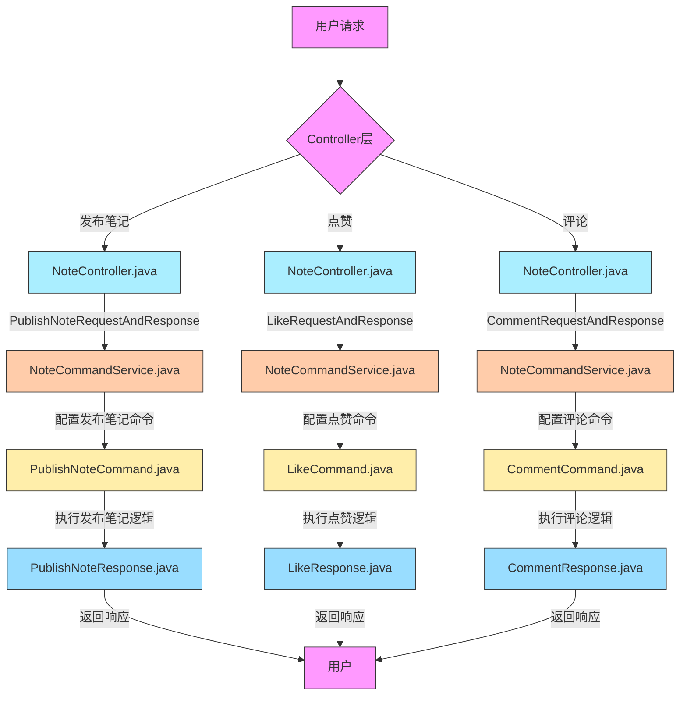

# 0.图与请求JSON

## 0.0.好处

- 命令的组合
- 命令的排队
- 命令的灵活解耦独立性

## 0.1流程图




## 0.2代码结构图

## 0.3请求Json

```java
localhost:8080/api/like
{
  "noteId": "note123",
  "userId": "user123"
}
```

```java
localhost:8080/api/comment
{
  "noteId": "note123",
  "userId": "user123",
  "comment": "非常好笔记！！我觉得看了很有用!"
}

```

```java
localhost:8080/api/publishNote
{
  "content": "这是一篇有趣的小红书",
  "userId": "测试用户A"
}
```


# 1.代码分析

## 1.1POJO设计

### 1.1.1：评论模块

```java
package com.xiaoyongcai.io.designmode.pojo.CommandPattern;

import lombok.AllArgsConstructor;
import lombok.Data;
import lombok.NoArgsConstructor;
import org.springframework.stereotype.Component;

@Component
@Data
@AllArgsConstructor
@NoArgsConstructor
public class CommentRequest{
    private String noteId;
    private String userId;
    private String comment;
}

```

```java
package com.xiaoyongcai.io.designmode.pojo.CommandPattern;

import lombok.AllArgsConstructor;
import lombok.Data;
import lombok.NoArgsConstructor;
import org.springframework.stereotype.Component;

@Component

@Data
@AllArgsConstructor
@NoArgsConstructor
public class CommentResponse{
    private boolean success;
    private String message;
}

```


### 1.1.2：点赞模块

```java
package com.xiaoyongcai.io.designmode.pojo.CommandPattern;

import lombok.AllArgsConstructor;
import lombok.Data;
import lombok.NoArgsConstructor;
import org.springframework.stereotype.Component;

@Component

@Data
@AllArgsConstructor
@NoArgsConstructor
public class LikeRequest{
    private String noteId;
    private String userId;

    // Getters and Setters
}

```

```java
package com.xiaoyongcai.io.designmode.pojo.CommandPattern;

import lombok.AllArgsConstructor;
import lombok.Data;
import lombok.NoArgsConstructor;
import org.springframework.stereotype.Component;

@Component

@Data
@AllArgsConstructor
@NoArgsConstructor
public class LikeResponse{
    private boolean success;
    private String message;
}


```


### 1.1.3：发帖模块

```java
package com.xiaoyongcai.io.designmode.pojo.CommandPattern;

import lombok.AllArgsConstructor;
import lombok.Data;
import lombok.NoArgsConstructor;
import org.springframework.stereotype.Component;

@Component

@Data
@AllArgsConstructor
@NoArgsConstructor
public class PublishNoteRequest{
    private String content;
    private String userId;

}
```

```java
package com.xiaoyongcai.io.designmode.pojo.CommandPattern;

import lombok.AllArgsConstructor;
import lombok.Data;
import lombok.NoArgsConstructor;
import org.springframework.stereotype.Component;

@Component

@Data
@AllArgsConstructor
@NoArgsConstructor
public class PublishNoteResponse{
    private boolean success;
    private String message;

    // Getters and Setters
}

```


## 1.2Service逻辑

### 1.2.0：抽象接口

```java
package com.xiaoyongcai.io.designmode.Service.CommandPattern;

public interface Command {
    void execute();
}

```


### 1.2.1：评论模块

```java
package com.xiaoyongcai.io.designmode.Service.CommandPattern.Impl;

import com.xiaoyongcai.io.designmode.Service.CommandPattern.Command;
import com.xiaoyongcai.io.designmode.pojo.CommandPattern.CommentRequest;
import com.xiaoyongcai.io.designmode.pojo.CommandPattern.CommentResponse;
import org.springframework.beans.factory.annotation.Autowired;
import org.springframework.stereotype.Service;
@Service
public class CommentCommand implements Command {
    private final CommentRequest request;
    private final CommentResponse response;

    public CommentCommand(CommentRequest request, CommentResponse response) {
        this.request = request;
        this.response = response;
    }
    @Override
    public void execute() {
        // 模拟评论的业务逻辑
        System.out.println("[命令模式]-笔记" + request.getNoteId()+"被用户"+request.getUserId()+"评论成功！内容是："+request.getComment());
        response.setSuccess(true);
        response.setMessage("[命令模式]-评论成功");
    }
}

```


### 1.2.2：点赞模块

```java
package com.xiaoyongcai.io.designmode.Service.CommandPattern.Impl;

import com.xiaoyongcai.io.designmode.Service.CommandPattern.Command;
import com.xiaoyongcai.io.designmode.pojo.CommandPattern.LikeRequest;
import com.xiaoyongcai.io.designmode.pojo.CommandPattern.LikeResponse;
import org.springframework.beans.factory.annotation.Autowired;
import org.springframework.stereotype.Service;

@Service
public class LikeCommand implements Command {

    // 删除构造函数中的 LikeRequest 和 LikeResponse 参数
    private final LikeRequest request;
    private final LikeResponse response;

    // 使用 @Autowired 注解让 Spring 自动注入 LikeRequest 和 LikeResponse
    @Autowired
    public LikeCommand(LikeRequest request, LikeResponse response) {
        this.request = request;
        this.response = response;
    }

    @Override
    public void execute() {
        // 执行点赞业务逻辑
        System.out.println("[命令模式] - 笔记" + request.getNoteId() + "已经被用户" + request.getUserId() + "点赞成功");
        response.setSuccess(true);
        response.setMessage("[命令模式] - 笔记点赞成功");
    }
}

```


### 1.2.3：发帖模块

```java
package com.xiaoyongcai.io.designmode.Service.CommandPattern.Impl;

import com.xiaoyongcai.io.designmode.Service.CommandPattern.Command;
import com.xiaoyongcai.io.designmode.pojo.CommandPattern.PublishNoteRequest;
import com.xiaoyongcai.io.designmode.pojo.CommandPattern.PublishNoteResponse;
import org.springframework.stereotype.Service;

@Service
public class PublishNoteCommand implements Command {
    private final PublishNoteRequest request;
    private final PublishNoteResponse response;


    public PublishNoteCommand(PublishNoteRequest request, PublishNoteResponse response) {
        this.request = request;
        this.response = response;
    }

    @Override
    public void execute() {
        //模拟发布笔记的业务逻辑
        System.out.println("[命令模式]-发布笔记命令成功"+request.getContent());
        response.setSuccess(true);
        response.setMessage("[命令模式]-发布笔记已经成功执行");
    }
}

```


### 1.2.4：整合模块

```java
package com.xiaoyongcai.io.designmode.Service.CommandPattern;

import com.xiaoyongcai.io.designmode.Service.CommandPattern.Impl.CommentCommand;
import com.xiaoyongcai.io.designmode.Service.CommandPattern.Impl.LikeCommand;
import com.xiaoyongcai.io.designmode.Service.CommandPattern.Impl.PublishNoteCommand;
import com.xiaoyongcai.io.designmode.pojo.CommandPattern.*;
import org.springframework.beans.factory.annotation.Autowired;
import org.springframework.stereotype.Service;

@Service
public class CommandService {

    @Autowired
    private PublishNoteCommand publishNoteCommand;

    @Autowired
    private LikeCommand likeCommand;

    @Autowired
    private CommentCommand commentCommand;

    public void executePublishNoteCommand(PublishNoteRequest request, PublishNoteResponse response) {
        publishNoteCommand = new PublishNoteCommand(request,response);
        publishNoteCommand.execute();
    }

    public void executeLikeCommand(LikeRequest request, LikeResponse response) {
        likeCommand = new LikeCommand(request,response);
        likeCommand.execute();
    }

    public void executeCommentCommand(CommentRequest request, CommentResponse response) {
        commentCommand = new CommentCommand(request,response);
        commentCommand.execute();
    }
}

```

## 1.3Controller

```java
package com.xiaoyongcai.io.designmode.Controller.CommandPattern;
import com.xiaoyongcai.io.designmode.Service.CommandPattern.CommandService;
import com.xiaoyongcai.io.designmode.pojo.CommandPattern.*;
import org.springframework.beans.factory.annotation.Autowired;
import org.springframework.web.bind.annotation.*;

@RestController
@RequestMapping("/api")
public class NoteController {

    @Autowired
    private CommandService commandService;

    @PostMapping("/publishNote")
    public PublishNoteResponse publishNote(@RequestBody PublishNoteRequest request) {
        PublishNoteResponse response = new PublishNoteResponse();
        commandService.executePublishNoteCommand(request, response);
        return response;
    }

    @PostMapping("/like")
    public LikeResponse like(@RequestBody LikeRequest request) {
        LikeResponse response = new LikeResponse();
        commandService.executeLikeCommand(request, response);
        return response;
    }

    @PostMapping("/comment")
    public CommentResponse comment(@RequestBody CommentRequest request) {
        CommentResponse response = new CommentResponse();
        commandService.executeCommentCommand(request, response);
        return response;
    }
}

```

