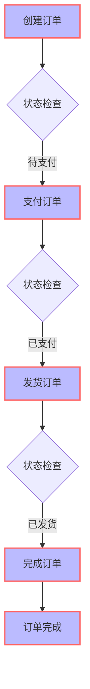

# 0.基础

## 0.1代码结构


## 0.2业务流程




## 0.3请求格式

1. **创建订单**
    请求 URL：
    `POST http://localhost:8080/orders/create`
    **请求体**：无 (简单地发送一个 `POST` 请求即可)
    **响应体**：

   ```json
   {
       "status": "success",
       "message": "订单创建成功，当前状态：待支付"
   }
   ```

2. **支付订单**
    请求 URL：
    `POST http://localhost:8080/orders/pay/{orderId}`
    其中 `{orderId}` 为你创建订单时生成的订单 ID。假设订单 ID 为 `1`，请求 URL 将是：
    `POST http://localhost:8080/orders/pay/1`
    **请求体**：无 (简单地发送一个 `POST` 请求即可)
    **响应体**：

   ```json
   {
       "status": "success",
       "message": "订单支付成功，当前状态：已支付"
   }
   ```

3. **发货订单**
    请求 URL：
    `POST http://localhost:8080/orders/ship/{orderId}`
    假设你要发货的订单 ID 是 `1`，请求 URL 将是：
    `POST http://localhost:8080/orders/ship/1`
    **请求体**：无 (简单地发送一个 `POST` 请求即可)
    **响应体**：

   ```json
   {
       "status": "success",
       "message": "订单发货成功，当前状态：已发货"
   }
   ```

4. **完成订单**
    请求 URL：
    `POST http://localhost:8080/orders/complete/{orderId}`
    假设你要完成的订单 ID 是 `1`，请求 URL 将是：
    `POST http://localhost:8080/orders/complete/1`
    **请求体**：无 (简单地发送一个 `POST` 请求即可)
    **响应体**：

   ```json
   {
       "status": "success",
       "message": "订单已完成"
   }
   ```

# 1.代码

## 1.1POJO设计

```java
package com.xiaoyongcai.io.designmode.pojo.StatePattern;

public interface OrderState {
    void handleRequest(OrderContext context);}

```

```java
package com.xiaoyongcai.io.designmode.pojo.StatePattern;

public class OrderContext {
    private OrderState state;
    public OrderContext(OrderState state) {
        this.state = state;
    }
    public void setState(OrderState state) {
        this.state = state;
    }
    public void request(){
        state.handleRequest(this);
    }
}

```

```java
package com.xiaoyongcai.io.designmode.pojo.StatePattern.Impl;

import com.xiaoyongcai.io.designmode.pojo.StatePattern.OrderContext;
import com.xiaoyongcai.io.designmode.pojo.StatePattern.OrderState;

public class PendingState implements OrderState {
    @Override
    public void handleRequest(OrderContext context) {
        System.out.println("[状态模式]：订单状态为：订单正在支付中");
        context.setState(new PaidState());
    }
}

```

```java
package com.xiaoyongcai.io.designmode.pojo.StatePattern.Impl;

import com.xiaoyongcai.io.designmode.pojo.StatePattern.OrderContext;
import com.xiaoyongcai.io.designmode.pojo.StatePattern.OrderState;

public class PaidState implements OrderState {
    @Override
    public void handleRequest(OrderContext context) {
        System.out.println("[状态模式]：订单状态为：订单已经支付,下一步是发货");
        context.setState(new ShippedState());
    }
}

```

```java
package com.xiaoyongcai.io.designmode.pojo.StatePattern.Impl;

import com.xiaoyongcai.io.designmode.pojo.StatePattern.OrderContext;
import com.xiaoyongcai.io.designmode.pojo.StatePattern.OrderState;

public class ShippedState implements OrderState {
    @Override
    public void handleRequest(OrderContext context) {
        System.out.println("[状态模式]：订单状态为：您下单的商品正在运输中,运输成功之后订单即可完成");
        context.setState(new CompletedState());
    }
}

```

```java
package com.xiaoyongcai.io.designmode.pojo.StatePattern.Impl;

import com.xiaoyongcai.io.designmode.pojo.StatePattern.OrderContext;
import com.xiaoyongcai.io.designmode.pojo.StatePattern.OrderState;

public class CompletedState implements OrderState {
    @Override
    public void handleRequest(OrderContext context) {
        System.out.println("[状态模式]：订单状态为：订单已经完成");
    }
}

```


## 1.2Service设计

```java
package com.xiaoyongcai.io.designmode.Service.StatePattern;

import com.xiaoyongcai.io.designmode.pojo.StatePattern.Impl.PendingState;
import com.xiaoyongcai.io.designmode.pojo.StatePattern.OrderContext;
import lombok.extern.slf4j.Slf4j;
import org.springframework.stereotype.Service;

import java.util.HashMap;
import java.util.Map;
@Service
@Slf4j
public class StatePatternOrderService {
    private static Map<Long, OrderContext> orders = new HashMap<>();
    private static Long orderIdCounter = 0L;

    // 创建订单并初始化状态为待支付
    public static void createOrder() {
        orderIdCounter++;
        OrderContext context = new OrderContext(new PendingState());
        log.info("[状态模式]：订单创建成功，订单序号为"+orderIdCounter);
        orders.put(orderIdCounter, context);

    }

    // 支付订单
    public static void payOrder(Long orderId) {
        OrderContext context = orders.get(orderId);
        if(context == null) {
            log.info("[状态模式]：尚未查询到该订单号，还请生成订单后再做订单状态变更");

        }
        if (context != null) {
            context.request(); // 执行状态转换
            log.info("[状态模式]：订单支付成功，订单序号为"+orderIdCounter);
        }

    }

    // 发货订单
    public static void shipOrder(Long orderId) {
        OrderContext context = orders.get(orderId);
        if(context == null) {
            log.info("[状态模式]：尚未查询到该订单号，还请生成订单后再做订单状态变更");

        }
        if (context != null) {
            context.request(); // 执行状态转换
            log.info("[状态模式]：订单发货成功，订单序号为"+orderIdCounter);
        }

    }

    // 完成订单
    public static void completeOrder(Long orderId) {
        OrderContext context = orders.get(orderId);
        if(context == null) {
            log.info("[状态模式]：尚未查询到该订单号，还请生成订单后再做订单状态变更");

        }
        if (context != null) {
            context.request(); // 执行状态转换
            log.info("[状态模式]：订单已经完成交易，订单序号为"+orderIdCounter);
        }
    }
}

```


## 1.3Controller设计

```java
package com.xiaoyongcai.io.designmode.Controller.StatePattern;

import com.xiaoyongcai.io.designmode.Service.BridgePattern.OrderService;
import com.xiaoyongcai.io.designmode.Service.StatePattern.StatePatternOrderService;
import org.springframework.beans.factory.annotation.Autowired;
import org.springframework.http.ResponseEntity;
import org.springframework.web.bind.annotation.PathVariable;
import org.springframework.web.bind.annotation.PostMapping;
import org.springframework.web.bind.annotation.RequestMapping;
import org.springframework.web.bind.annotation.RestController;

@RestController
@RequestMapping("/orders")
public class StatePatternController {
    @Autowired
    private final StatePatternOrderService statePatternOrderService;

    public StatePatternController(StatePatternOrderService statePatternOrderService) {
        this.statePatternOrderService = statePatternOrderService;
    }
    // 创建订单并设置初始状态
    @PostMapping("/create")
    public ResponseEntity<String> createOrder() {
        StatePatternOrderService.createOrder();
        return ResponseEntity.ok("订单创建成功，当前状态：待支付");
    }

    // 触发状态变化
    @PostMapping("/pay/{orderId}")
    public ResponseEntity<String> payOrder(@PathVariable Long orderId) {
        StatePatternOrderService.payOrder(orderId);
        return ResponseEntity.ok("订单支付成功，当前状态：已支付");
    }

    @PostMapping("/ship/{orderId}")
    public ResponseEntity<String> shipOrder(@PathVariable Long orderId) {
        StatePatternOrderService.shipOrder(orderId);
        return ResponseEntity.ok("订单发货成功，当前状态：已发货");
    }

    @PostMapping("/complete/{orderId}")
    public ResponseEntity<String> completeOrder(@PathVariable Long orderId) {
        StatePatternOrderService.completeOrder(orderId);
        return ResponseEntity.ok("订单已完成");
    }

}

```

